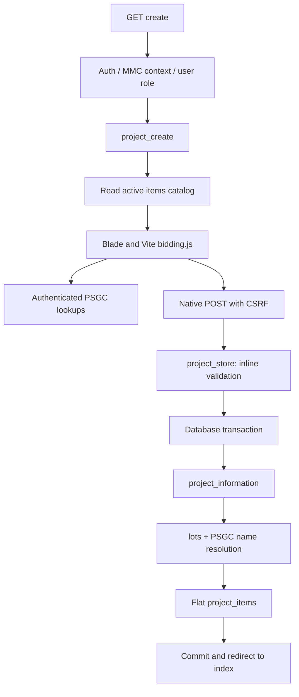

# Input Bidding Document – Technical & Functional Audit

## 1. Executive Summary

Audit date: 4 October 2026. Feature: MMC Tracker **Input Bidding Document**. Requested entry point: `https://tracker.metro-mobilia.com/project/bidding/create`. Repository snapshot: `ffae079`; line references below refer to the inspected working-tree files. This is an investigation-only report. The only file created for this audit is this document. No application fixes, migrations, database writes, record deletion, deployment, or changes to business rules were performed.

The feature creates a bidding document in `project_information`, related rows in `lots`, and flat lot-item rows in `project_items`. It also exposes listing, detail, edit, update, and delete routes. The create UI additionally presents delivery addresses and key stages, but its controller does not persist that hierarchy.

This report identifies **22 confirmed technical bugs**: **1 CRITICAL, 10 HIGH, 10 MEDIUM, 1 LOW**; **10 potential bugs/risks**; and **12 logical/business-rule concerns**. These categories count distinct findings in sections 17–19; repeated references elsewhere are not additional findings.

The highest risks are deletion of another project's items through an incorrect relationship, conditional loss of existing items during update, incompatible edit rendering/payloads, discarded unit costs and addresses/stages, and client-controlled financial totals. The normal edit form also omits status while update writes a null status into a nonnullable column. That failure can occur **before** child deletion; ordinary UI submission must not be described as always committing data loss.

Evidence labels used throughout:

| Label | Meaning |
| --- | --- |
| **CONFIRMED FROM CODE** | Directly established by repository code, route inspection, or local read-only schema inspection. A defect's occurrence in production is not implied. |
| **LIKELY / INFERRED** | Consequence depends on production schema/configuration, actual records, timing, or an unexecuted request. |
| **UNKNOWN / NEEDS BUSINESS CONFIRMATION** | Intended business policy cannot be established from implementation alone. |
| **ISOLATED PROBE** | Actually executed without application saves: synthetic browser DOM with intercepted requests, standalone validator/normalizer calls, or SQL generation without query execution. |

Production page retrieval failed through the available web tool; no authenticated production browser session was available. The managed browser runtime was unavailable. Frontend probes used an installed standalone Chromium/Playwright browser, synthetic DOM, actual source scripts, and intercepted lookups; they were not authenticated production or full Blade-rendered end-to-end tests. Local database inspection was read-only. Local `project_information`, `lots`, and `project_items` each contained zero records. Existing production damage, production deployment parity, and production access policies cannot be assessed from that empty local dataset.

Installed versions inspected: PHP 8.3, Laravel 11.54.0, Spatie Permission 6.25.0, Laravel Boost 2.9.1, Pest 3.7.2, Tailwind CSS 3.4.19, Vite 5.4.21. Framework documentation was consulted through Laravel Boost for validation, transactions, and authorization. The installed application's entry point uses `Application::configure()` in `bootstrap/app.php:12–50`; the repository's actual structure takes precedence over generic guidance about an older bootstrap structure.

## 2. Feature Purpose

**CONFIRMED FROM CODE:** The page title is “Create Bidding Document” and subtitle is “Procurement & Bidding Management” (`resources/views/operation/bidding/create.blade.php:5–10`). Users enter project identifiers, procuring agency, ABC, delivery period, bidding dates, status, and lots with delivery geography. Address and key-stage controls suggest a more detailed distribution hierarchy. Catalog options are active `App\Models\New\Item` records, not entries fetched from the main operational project page.

The bidding document is itself a `ProjectInformation` record. Its string `project_id` is a unique business identifier. It is **not** a selected existing `App\Models\Project` record, and the create flow does not query the legacy `projects`, `lot`, or school tables. Routes use numeric `project_information.id` to identify a saved document.

**UNKNOWN / NEEDS BUSINESS CONFIRMATION:** Whether this module is an initial tender register, a quotation calculator, an approved procurement record, or a distribution planning document. No supporting approval workflow, attachment ingestion, copy operation, or formal resubmission action is implemented here.

## 3. User Workflow

1. A signed-in user enters the MMC company context and must have the `user` role. An `admin` role by itself does not automatically satisfy this route's `hasAnyRole('user')` check.
2. Navigate to the bidding listing and choose create. The header Back and footer Cancel links return to the listing.
3. Select Project Code from `SME`, `SFP`, `MT`, `Textbook`, `DCP`; enter project name, business Project ID No., procuring entity, ABC, delivery days, pre-bid conference, bid opening, and one of six statuses.
4. One lot and one delivery-address textarea initially render. Select region, province, city/municipality, and barangay. Additional lots are supported by a template.
5. Add Delivery Address, Add Key Stage, and Add Item are presented. Actual inspected behavior is defective: address addition has no template, one stage click creates two stages, and the generated Add Item button has no handler. There is no initial visible item row in a fresh lot.
6. Click Save project. A normal HTML POST is sent; there is no AJAX save or upload.
7. Laravel validates a small subset of the payload, then a transaction saves the parent, lots, and any flat item arrays that actually reach the controller. Nested address/stage fields and pre-bid date are ignored.
8. On success, redirect to the listing with a success flash message. The inspected operation listing/layout does not render that success message.
9. A saved record can be viewed, edited, or deleted. The show page uses the correct `lots.items` graph. Edit uses an incompatible flat relationship/partial contract. Delete uses a wrong project-items relationship, with a cross-project deletion risk.

Steps 1–9 describe code paths and isolated observations; a complete production save was **NOT TESTED**. Draft is an ordinary status value, not a separate autosave path. There is no dedicated resubmit, duplicate/copy, or import action in this workflow.

## 4. Routes

`routes/web.php:257–276`, inside the operation group at `:140–144` and outer authentication group at `:53`:

```php
Route::get('project/bidding', [BiddingController::class, 'project_index'])
    ->name('project.bidding.index');
Route::get('project/bidding/create', [BiddingController::class, 'project_create'])
    ->name('project.bidding.create');
Route::post('project/bidding', [BiddingController::class, 'project_store'])
    ->name('project.bidding.store');
Route::get('project/bidding/{bidding}', [BiddingController::class, 'project_show'])
    ->name('project.bidding.show');
Route::get('project/bidding/{bidding}/edit', [BiddingController::class, 'project_edit'])
    ->name('project.bidding.edit');
Route::put('project/bidding/{bidding}', [BiddingController::class, 'project_update'])
    ->name('project.bidding.update');
Route::delete('project/bidding/{bidding}', [BiddingController::class, 'project_destroy'])
    ->name('project.bidding.destroy');
```

All seven use `App\Http\Controllers\BiddingController`. There is **PUT, no PATCH** route. `{bidding}` implicitly binds `App\Models\ProjectInformation` by numeric `id`, not its business `project_id`. No model route-key override or company global scope exists.

The enclosing operation middleware is:

```php
Route::middleware(['auth', 'company.context:MMC', 'role:user'])->group(function () {
    // operation routes, including bidding
});
```

Read-only `php artisan route:list --path=project/bidding -vv --except-vendor --no-interaction` confirmed seven routes and resolved middleware: `EncryptCookies`, `AddQueuedCookiesToResponse`, `StartSession`, `ShareErrorsFromSession`, `ValidateCsrfToken`, `Authenticate`, `SubstituteBindings`, local Boost `InjectBoost`, `CheckCompany:MMC`, `RoleMiddleware:user`. The custom company/role aliases are registered in `bootstrap/app.php:23–26`. No bidding gate, policy, `can` middleware, or controller authorization call was found.

Dependent lookups are actual web routes, despite their `/api` prefix (`routes/web.php:358–369`):

```php
Route::prefix('api')->group(function () {
    Route::get('/countries', [LocationController::class, 'countries']);
    Route::get('/regions', [LocationController::class, 'regions']);
    Route::get('/provinces', [LocationController::class, 'provinces']);
    Route::get('/cities', [LocationController::class, 'cities']);
    Route::get('/barangays', [LocationController::class, 'barangays']);
});
```

| Method / URI | Name | Handler | Parameters / use | Middleware |
| --- | --- | --- | --- | --- |
| GET `/api/countries` | None | `LocationController::countries` | Hardcoded PH/Philippines; create country is already static | Web + auth |
| GET `/api/regions` | None | `regions` | PSGC regional options | Web + auth |
| GET `/api/provinces?region={code}` | None | `provinces` | Province options for region | Web + auth |
| GET `/api/cities?province={code}` | None | `cities` | City/Mun/SubMun options for province | Web + auth |
| GET `/api/cities?region={code}` | None | `cities` | Fallback when selected region has no provinces | Web + auth |
| GET `/api/barangays?city={code}` | None | `barangays` | Barangay options | Web + auth |
| GET `/project/bidding?search=...&status=...` | `project.bidding.index` | `BiddingController::project_index` | Server listing filter, not AJAX | Operation middleware above |
| POST `/company/switch` | `company.switch` | `CompanyController::switch` | Separate sidebar form; changes session company | Outer auth/web |
| POST `/logout` | `logout` | `Auth\AuthenticatedSessionController::destroy` | Separate sidebar form (`routes/auth.php:57–58`) | Auth/web |

Finance CRUD mirrors the module on `/bidding`, `/bidding/create`, `/bidding/{bidding}`, `/bidding/{bidding}/edit`, named `bidding.index/create/store/show/edit/update/destroy`, using `index/create/store/show/edit/update/destroy` in the same controller (`routes/web.php:310–329`). Its group has auth and `role:finance`, **without** `company.context:MMC`. It shares the same bidding tables. This matters to access boundaries and any future fixes.

No upload/import endpoint, file input, multipart form, autocomplete endpoint, or AJAX submission endpoint is used by this page. Legacy division/municipality methods elsewhere in `LocationController` are not this page's dependencies.

## 5. Architecture / Request Flow

Create load (`BiddingController::project_create`, `app/Http/Controllers/BiddingController.php:104–110`):

```php
$catalogItems = Item::where('active', 1)->orderBy('item_name')->get();
return view('operation.bidding.create', compact('catalogItems'));
```

Browser GET → web/auth/company/role middleware → route → controller → `New\Item` active catalog query → Blade layout/main/partials → Vite `app.js` imports `bidding.js` → inline create scripts → PSGC fetch requests. Authentication/company layout rendering may add user, company, pivot, and role reads. There is **no feature service/repository/Form Request** between controller and models.

Save (`project_store`, `:188–257`): browser native form POST with CSRF → same middleware → inline `$request->validate()` → `DB::transaction()` → explicit `ProjectInformation::create()` → relation-created lots → four PSGC display-name lookups per lot → relation-created flat items → transaction commit → redirect with success flash. Validation occurs before transaction; thrown errors inside transaction roll back and are rethrown.



The browser hierarchy and saved hierarchy diverge; see sections 7–9. No observer, job, file storage, email, or external integration is invoked by the bidding controller. The catalog model's creation hook is not triggered by reading active items.

## 6. Files Involved

Line counts use `splitlines()` on the inspected files, including blank/comment lines. Paths are relative to the repository root.

| File | Lines | Responsibility / important references |
| --- | ---: | --- |
| `routes/web.php` | See `257–276`, `310–329`, `358–369` | Bidding CRUD, finance mirrors, lookup routes |
| `bootstrap/app.php` | 50 | Actual routing/middleware/exception registration |
| `app/Http/Controllers/BiddingController.php` | 495 | All CRUD, inline validation/transforms/transactions |
| `app/Http/Controllers/LocationController.php` | 94 | Geography lookup methods `41–93` |
| `app/Http/Middleware/CheckCompany.php` | 44 | Membership/session company entrance check `23–39` |
| `app/Http/Middleware/RoleMiddleware.php` | 25 | Authentication and Spatie role check `13–23` |
| `app/Models/ProjectInformation.php` | 43 | Parent table, fillable, correct lots and incorrect items relationship |
| `app/Models/ProjectLot.php` | 37 | Bidding `lots`; project/items relations |
| `app/Models/ProjectItem.php` | 26 | Bidding `project_items`; fillable/lot relation |
| `app/Models/New/Item.php` | 65 | Catalog `items`; unused legacy Project association `61–63` |
| `app/Models/PSGC.php` | 26 | Lookup table definition; class name Psgc |
| `app/Models/User.php`, `app/Models/Company.php` | Supporting | Company pivot/role/session context, not document ownership |
| `app/Http/Controllers/CompanyController.php` | Supporting | Separate sidebar company switch `116–141` |
| `app/View/Components/ProjectAppLayout.php` | 18 | Renders `layouts.project_app` at `16` |
| `resources/views/layouts/project_app.blade.php` | 107 | CSRF meta `6`, Vite `13`, sidebar, slot, scripts stack `105` |
| `resources/views/layouts/project-sidebar.blade.php` | 277 | Company queries/forms `17–78`, logout `259–268` |
| `resources/views/operation/bidding/create.blade.php` | 176 | Main create form `38–45`, inline broken geography `48–121`, unused calculation `128–165` |
| `resources/views/operation/bidding/partials/_forms.blade.php` | 621 | Inline styles `1–443`, errors `448–460`, fields, lot/item templates `615–621` |
| `resources/views/operation/bidding/partials/_lot.blade.php` | 139 | Lot identity/geography, address partial, lot total |
| `resources/views/operation/bidding/partials/_address.blade.php` | 41 | Nested address textarea and stage container |
| `resources/views/operation/bidding/partials/_keystage.blade.php` | 31 | Nested stage name, item partial loop, older Add Item button |
| `resources/views/operation/bidding/partials/_items.blade.php` | 123 | Flat lot-item names and repeated catalog options |
| `resources/views/operation/bidding/index.blade.php` | 40 | Listing shell and search/table partials |
| `resources/views/operation/bidding/partials/_search.blade.php` | 95 | GET search/status controls |
| `resources/views/operation/bidding/partials/_table.blade.php` | 241 | Parent metadata, financial display, show/edit/delete links, pagination |
| `resources/views/operation/bidding/show.blade.php` | 312 | Correct nested lots/items display, view-only sums/formatting |
| `resources/views/operation/bidding/edit.blade.php` | 173 | Incompatible edit form and inline top-level item generator |
| `resources/js/app.js` | 10 | Imports bootstrap/bidding/deliveries/delivery-monitoring/project-details; starts Alpine |
| `resources/js/bootstrap.js` | 4 | Shared Axios initialization; bidding uses fetch |
| `resources/js/deliveries.js` | 237 | Shared import; guarded by absent filter-container |
| `resources/js/delivery-monitoring.js` | 263 | Shared import; guarded by absent delivery-monitoring root |
| `resources/js/project-details.js` | 227 | Shared import; no matching project lazy panels here |
| `resources/views/operation/bidding/partials/_status-badge.blade.php` | 22 | Present but not included by these operation pages |
| `resources/views/operation/bidding/partials/_pagination.blade.php` | 14 | Present but unused here; table supplies pagination |
| `resources/views/components/project-app-layout.blade.php` | 3 | Placeholder; class component renders actual layout |
| `vite.config.js` | 11 | app.css/app.js Vite entry points |
| `resources/js/bidding.js` | 470 | Dynamic fields, totals, lookups, duplicate listeners |
| `tests/Feature/BiddingStoreTest.php` | 49 | Stale finance save test, no graph assertions |
| `tests/Pest.php` | 50 | RefreshDatabase inclusion `17–19` |

No database query appears in create field partials through explicit `DB::` calls. Relationship access in `_forms:582–583` could lazy-load if reused with an uneager-loaded project; create has no project model. Sidebar Blade calls `currentCompany()` and reads the `companies` relationship, which can issue SQL. Show calculates collection sums in Blade. There is no large catalog JSON via `Js::from`, `@json`, or `toJson`; the repeated catalog is HTML `<option>` markup. `_lot`/`_items` call `toArray()` on individual supplied models.

Finance views are parallel consumers of controller/catalog behavior, not the operation main view. `App\Models\Project`, singular `App\Models\Lot`, and singular `App\Models\Keystage` are separate legacy concepts. The three-line `resources/views/components/project-app-layout.blade.php` placeholder is not the class layout rendered by `ProjectAppLayout`.

## 7. Form Field Mapping

Notation: `i` = lot array index, `a` = address index, `s` = stage index, `j` = item index. `PI` = `project_information`; `PL` = `lots`; `IT` = `project_items`. “Required” distinguishes HTML and backend. Disabled controls are excluded from a native form submission. Templates are inert until cloned. Defaults shown are UI and server defaults where different.

### Create parent fields

| Field | UI Label | HTML Name | Type | Required? | Source | Validation | DB Table.Column | Default | Notes |
| --- | --- | --- | --- | --- | --- | --- | --- | --- | --- |
| CSRF | None | `_token` | Hidden, generated by `@csrf` | Middleware | Session | CSRF middleware | None | Session token, not reproduced | `create:41`; never a business field |
| Project code | Project Code | `project_code` | Select | HTML yes / server yes | Hardcoded five codes | required/string/max255 | PI.project_code | Empty selection | `_forms:480–487`; no old selection restoration; backend no allowlist |
| Project name | Project name | `project_name` | Textarea | HTML no / server yes | User + old input | required/string/max255 | PI.project_name | Empty | `491–496`; trimmed on save |
| Business ID | Project ID No. | `project_id` | Text | HTML no / server yes | User + old input | required/string/max255 | PI.project_id | Empty | `500–502`; DB unique, not an existing-project dropdown |
| Agency | Procuring entity / Agency | `procuring_entity` | Text | No | User + old input | None | PI.procuring_entity | UI empty; server `''` | `506–508` |
| ABC | Approved Budget for the Contract (ABC) | `approved_budget_contract_abc` | Number | No | Manual entry, then JS lot sum | None | PI.approved_budget_contract_abc | UI blank, JS often `0.00`; server 0 | `519–524`; no step/min/max/value/old binding; comma assignment sanitizes number input to blank |
| Delivery period | Delivery period (days) | `delivery_period` | Number | No | User + old input | None | PI.delivery_period (varchar) | Empty | `530–532`; browser default integer step, no minimum; saved as text |
| Pre-bid date | Pre-Bid Conference | `date_of_pre_bid_conference` | Date | No | User + old input | None | **Not saved**; schema has PI.pre_bid_conf | Empty | `537–538`; UI/model/controller names incompatible |
| Bid opening | Bid opening | `date_of_bid_opening` | Date | No | User + old input | None | PI.date_of_bid_opening | Empty → null | `542–543`; server accepts arbitrary strings |
| Status | Status | `status` | Select | No | Six hardcoded labels | None | PI.status | Draft | `548–555`; Draft/For Review/Published/Awarded/Cancelled/Completed; no transition enforcement |

### Lot, address, stage, and item fields

| Field | UI Label | HTML Name | Type | Required? | Source | Validation | DB Table.Column | Default | Notes |
| --- | --- | --- | --- | --- | --- | --- | --- | --- | --- |
| Lot number | Lot badge; hidden value | `lots[i][lot_no]` | Hidden | Server yes | Blade index+1 / JS visible count | required/string/max50 | PL.lot_no | `Lot 1` | `_lot:19–23`; supplied previous lot_no is not restored; collisions after deletion |
| Country | Country | `lots[i][country_code]` | Select | No | Static PH | None | PL.country | PH → Philippines | `_lot:40–46`; server direct key access if omitted; no country-change logic |
| Region | Region | `lots[i][region_code]` | Select | No | PSGC lookup | None | PL.region | Empty → null | `_lot:56–60`; code resolved to name or unknown raw code |
| Province | Province | `lots[i][province_code]` | Select | No | Region lookup | None | PL.province | Empty, disabled initially | `_lot:69–73`; omitted while disabled |
| City | City / Municipality | `lots[i][city_code]` | Select | No | Province/region lookup | None | PL.city_municipality | Empty, disabled initially | `_lot:82–86` |
| Barangay | Barangay | `lots[i][barangay_code]` | Select | No | City lookup | None | PL.barangay | Empty, disabled initially | `_lot:95–99` |
| Address | Delivery Address / address placeholder | `lots[i][addresses][a][delivery_address]` | Textarea | No | User; nested array | None | **Not saved** | Empty | `_address:8–14`; controller instead expects flat `lots[i][delivery_address]` |
| Stage | Key Stage Name | `lots[i][addresses][a][keystages][s][name]` | Text | No | Blade or JS-created input | None | **Not saved** | Empty | `_keystage:3–6`; `bidding.js:372–375`; plural keystages table has no name column |
| Item selection | Select Item / Item Description | `lots[i][items][j][item_description]` | Select | No | Active catalog | None | IT.item_description | Empty; null/absent → N/A | `_items:22–39`; value is catalog description, not item ID; text is item_name |
| Unit | Unit | `lots[i][items][j][unit]` | Text | No | Old value / catalog data-unit | nullable/string/max50 | **Create ignores it**; expects unit_of_measure → IT.unit | Empty UI, saved N/A if no alternate key | `_items:43–50` |
| Quantity | Quantity / `0` placeholder | `lots[i][items][j][quantity]` | Number | No | User / old value | nullable/numeric/min0 | IT.quantity | UI empty; server 0 | `_items:53–61`; min0, no fractional step or max |
| Unit cost | ₱ / `0.00` placeholder | `lots[i][items][j][unit_cost]` | Number in CSS-hidden wrapper, readonly | No | Intended catalog price | None | **Not saved on create**; update IT.unit_cost | Empty | `_items:64–78`; step .01/min0; no option data-price or restored value; CSS-hidden still submits |
| Total amount | ₱ amount | `lots[i][items][j][total_amount]` | **Editable text** | No | User input | None | IT.total_amount | UI blank; absent/null → 0 | `_items:83–88`; comment says computed/readonly but attributes do not; no old/value |
| Description | Description | `lots[i][items][j][description]` | Readonly text | No | old(description), not persisted item_description | None | **Not saved** | Empty | `_items:91–99`; item change handler does not update it |
| Remarks | Remarks | `lots[i][items][j][remarks]` | Text | No | User / old value | nullable/string | IT.remarks | UI empty; null/absent → N/A | `_items:102–109`; no server maximum |

The item partial emits **flat** `lots[i][items][j]` names even when nested visually under an address/stage. It ignores its address/stage context. It is therefore inaccurate to say every item is nested and universally ignored by create. Address/stage names are ignored; flat items can be accepted if present. Different stages can produce colliding flat item names.

`_lot:9` assigns two default blank `$items`, but never iterates that variable. Fresh addresses have no stages, so fresh lots render no items. `_keystage` renders stage-provided item rows, but `_lot` does not render previously submitted flat `lotData['items']` directly.

### Edit and dynamically generated edit fields

Every ordinary edit input uses `$project` directly, with no `old()` restoration and no HTML required attributes (`edit.blade.php:37–99`). Only name/ID are backend-validated. The edit form includes `_token` (`:22`) and hidden `_method=PUT` (`:23`).

| Field | UI Label | HTML Name | Type | Required? | Source | Validation | DB Table.Column | Default | Notes |
| --- | --- | --- | --- | --- | --- | --- | --- | --- | --- |
| Business ID | Project ID | `project_id` | Text | Server yes | PI.project_id | required/string/max255 | PI.project_id | Existing | `edit:37` |
| Name | Project Name | `project_name` | Text | Server yes | PI.project_name | required/string/max255 | PI.project_name | Existing | `43` |
| Agency | Procuring Entity | `procuring_entity` | Text | No | Parent | None | PI.procuring_entity | Existing | `49` |
| ABC | ABC | `approved_budget_contract_abc` | Number | No | Parent | None | PI.approved_budget_contract_abc | Existing | `55`; lacks step/min/max; no create ABC DOM id |
| Parent lot label | Lot No | `lot_no` | Text | No | Parent, not lots | None | PI.lot_no | Existing or blank | `61`; distinct from PL.lot_no |
| Period | Delivery Period | `delivery_period` | Text | No | Parent | None | PI.delivery_period | Existing | `67` |
| Country | Country placeholder | `country` | Text | No | Parent | None | PI.country | Existing or blank | `83` |
| Region | Region placeholder | `region` | Text | No | Parent | None | PI.region | Existing or blank | `86` |
| Province | Province placeholder | `province` | Text | No | Parent | None | PI.province | Existing or blank | `89` |
| City | City placeholder | `city_municipality` | Text | No | Parent | None | PI.city_municipality | Existing or blank | `92` |
| Barangay | Barangay placeholder | `barangay` | Text | No | Parent | None | PI.barangay | Existing or blank | `95` |
| Address | Address placeholder | `address` | Text | No | **Nonexistent project.address property** | None | PI.delivery_address via fallback | Blank | `98`; does not load actual delivery_address |
| Item number | Item No placeholder | `items[n][item_no]` | Text | No | Inline JS counter | None | **Not saved from top-level item** | Blank | `edit:149–150`; helper overwritten by Vite module |
| Description | Description placeholder | `items[n][item_description]` | Text | No | Inline JS | None | Used only as outer-loop gate | Blank | `152–153` |
| Unit | Unit placeholder | `items[n][unit]` | Text | No | Inline JS | None | Ignored as top-level field | Blank | `155–156` |
| Quantity | Quantity placeholder | `items[n][quantity]` | Text | No | Inline JS | None | Used in unused multiplication | Blank | `158–159` |
| Unit cost | Unit Cost placeholder | `items[n][unit_cost]` | Text | No | Inline JS | None | Used in unused multiplication | Blank | `161–162` |
| Amount | Total Amount placeholder | `items[n][total_amount]` | Text | No | Inline JS | None | Ignored as top-level field | Blank | `164–165` |

Existing edit rows include `_items` with `i/item` only, despite that partial requiring `lotIndex/itemIndex/catalogItems`. Such rows cannot be treated as a correctly rendered edit field set. Edit has no status, project_code, date, preparation, notes, nested lot controls, or lot template. It posts neither the create hierarchy nor the controller's complete update contract.

### Buttons, other forms, and absent controls

| Control | Trigger / payload effect |
| --- | --- |
| Add lot (`_forms:572`) | Type button; clones lot-template |
| Remove lot (`_lot:24`) | Removes DOM; no delete ID or totals update |
| Add Delivery Address (`_lot:121–126`) | Calls addAddress; missing address-template |
| Add Key Stage (`_address:34–39`) | Two delegated handlers create two stage inputs |
| Add Item (`_keystage:26–28` / JS `383–386`) | Old inline helper lacks proper context; generated button unhandled |
| Remove item (`_items:112–121`) | Removes DOM; does not recalculate |
| Save project (`_forms:603`) | Native submit; no disable/idempotency handler |
| Update Bidding (`edit:134`) | Native submit, PUT spoofing |
| Listing search | GET text `search` + select `status`, no DB write; `_search:14–47` |
| Listing delete | Separate POST `_token`, `_method=DELETE`, browser confirm; `_table:89–95` |
| Sidebar company switch | Separate POST `_token`, `company_id` select, active membership options, onchange submit; sidebar `53–78`; validates integer/exists then active user membership (`CompanyController::switch:118–134`) |
| Sidebar logout | Separate POST `_token`; sidebar `259–268` |

Company switch/logout fields do **not** enter the bidding POST. There are no checkbox, radio, file, modal, document_id, lot_id, catalog item ID, or company_id inputs in the bidding create form. No brand control currently renders; `$brand` in `_items:15` is unused. No field values containing credentials/session tokens are included in this report.

Server-only accepted/mapped fields: create accepts `prepared_by`, `prepared_date`, `verified_by`, flat `lots[i][delivery_address]`, and `lots[i][items][j][unit_of_measure]`; update accepts status, dates, preparation fields, notes, nested lots/items and item brand even though the current edit form does not supply them. These are additional request surfaces, not hidden UI inputs.

## 8. Database Mapping

Read-only local schema/metadata was compared with migrations. The seven feature/catalog/hierarchy tables below were InnoDB with `utf8mb4_unicode_ci`; relevant constraints matched inspected core migrations. Local SQL mode included `STRICT_TRANS_TABLES`, `NO_ZERO_IN_DATE`, `NO_ZERO_DATE`, `ONLY_FULL_GROUP_BY`. Production schema and SQL mode were not verified.

| Table | Purpose | Read | Insert | Update | Delete | Important Columns |
| --- | --- | --- | --- | --- | --- | --- |
| `project_information` | Bidding document parent | Index/show/edit/binding | Create | Update | Destroy | id PK, business project_id unique, project_code, name, ABC, status, dates |
| `lots` | Document's bidding lots | Show/edit | Create; updateOrCreate on crafted update | Update by parent+lot_no | Parent FK cascade, no explicit removed-lot cleanup | id PK, project_id FK, lot_no, geography, delivery_address |
| `project_items` | Flat lot items | Show; incorrect edit relation | Create/update replacement | No in-place item update | Update deletes, wrong destroy relationship, lot cascade | id PK, lot_id FK, item_no, description, unit, quantity, cost, amount |
| `items` | Item catalog | Active catalog create load | No | No | No explicit delete; parent delete may SET NULL project_id | unique item_id, item_name/description/unit/price/active, optional project_id |
| `psgc` | Geographic master | Lookups + per-lot name resolution | No | No | No | unique psgc_code, geolevel, region/province/city codes |
| `delivery_address` | Separate schema hierarchy, **unused by this save** | No bidding controller read | No | No | Parent/lot cascade if pre-existing linked rows | project_id + lot_id FKs, delivery_address_* fields |
| `keystages` | Separate schema hierarchy, **unused by this save** | No bidding controller read | No | No | FK SET NULL on related deletion | nullable project_id/lot_id/delivery_address_id, package_no, job counters |

Shared infrastructure reads: authentication uses `users` (PK `user_id`); company middleware/sidebar use `companies` (PK `company_id`) and `company_user`; Spatie roles use configured role/pivot tables (default `roles`, `model_has_roles`, and permission tables when applicable). No bidding controller writes these. Session/cookie/CSRF activity is framework infrastructure; database session writes depend on the deployed session driver, which was not asserted. `company.switch` changes session context, not bidding ownership. Local `companies`/`company_user` were absent, so the local full authenticated screen was not proven operational; this is not evidence those tables are absent in production.

Core column/constraint inventory:

| Table | Schema details relevant to this audit |
| --- | --- |
| `project_information` | unsigned bigint AI id PK; `project_id` varchar255 NOT NULL unique; `project_name` varchar255 NOT NULL; `project_code` nullable varchar255; `procuring_entity` NOT NULL varchar255 default `''`; ABC **DECIMAL(15,2) NOT NULL**, no DB default; status NOT NULL enum six UI values default Draft; nullable dates/timestamps; no owner/company FK |
| `lots` | unsigned bigint AI id PK; project_id NOT NULL FK→project_information.id **ON DELETE CASCADE**; lot_no varchar50 NOT NULL; **UNIQUE(project_id,lot_no)**; country varchar255 NOT NULL default Philippines; nullable region/province/city_municipality/barangay varchar255; nullable delivery_address/notes_special_condition text; timestamps |
| `project_items` | unsigned bigint AI id PK; nullable lot_id FK→lots.id **CASCADE**; nullable item_no integer; **UNIQUE(lot_id,item_no)**; nullable item_description text/unit varchar50/brand varchar255/remarks text; quantity, unit_cost, total_amount **nullable DECIMAL(15,2)**, no default; timestamps |
| `items` | id PK; required unique item_id varchar255; required code_prefix/item_name varchar255; nullable description text/unit varchar255; price and supplier_price **DECIMAL(15,2) NOT NULL default 0**; active boolean default1; nullable indexed project_id FK→project_information.id **SET NULL** |
| `psgc` | id PK; required unique psgc_code varchar10; required name varchar255; geographic_level enum Reg/Prov/City/Mun/SubMun/Bgy; nullable correspondence/parent/region/province/city codes varchar10; indexes on geographic_level, region_code, province_code, city_code (not parent_code); no geographic FKs |
| `delivery_address` | id PK; required indexed project_id FK→project_information.id CASCADE; required indexed lot_id FK→lots.id CASCADE; nullable varchar255 delivery_address_region/province/municipality/barangay/otherInformation; timestamps/remember_token; **no generic delivery_address text column** |
| `keystages` | id PK; nullable individually indexed project_id/lot_id/delivery_address_id FKs **SET NULL**; nullable unsigned package_no; unsigned total_jobs/pending_jobs/failed_jobs default0; nullable failed_jobs_ids/options/cancelled_at/finished_at plus timestamps/remember_token; **no stage name column** |

Additional parent columns not populated by create: nullable `lot_no`, parent country/region/province/city_municipality/barangay, `delivery_address`, `notes_special_condition`, `reference_no`, `funding_source`, `mode_of_procurement`, `project_id_no`, `bid_submission_deadline`, `notice_of_award_date`, `pre_bid_conf`. Preparation fields are mapped but absent from create UI. This explains blank metadata displayed on the listing.

Migration evidence:

- `database/migrations/2026_06_26_094046_create_project_information_table.php:11–53` — parent columns, business ID unique, ABC/status.
- `2026_06_26_095001_create_lots_table.php:14–39` — parent FK and lot unique pair.
- `2026_06_26_161100_create_project_items_table.php:11–38` — nullable item keys, decimals, cascade, unique pair.
- `2026_06_29_055633_create_items_table.php:14–43` — catalog and optional parent association.
- `2026_06_27_031110_create_psgc_table.php:14–56` — geography structure/indexes.
- `2026_07_14_082554_add_project_code_to_project_information.php:14–15` — project_code.
- `2026_07_14_083101_add_table_to_project__information.php:14–16` — pre_bid_conf/project_id_no.
- `2026_07_16_070116_create_delivery_address_table.php:14–39` — separate address hierarchy.
- `2026_07_16_072602_add_columns_to_keystages_table.php:14–48` — stage associations/structure.

The parent has only PK and unique business-ID indexes relevant here; no status/project_code/created_at index or nonnegative-money CHECK was found. Nullable child keys weaken UNIQUE protection: multiple NULL values are permitted. FKs enforce existence, but the three independent keystage FKs and address's two FKs do not prove their project/lot/address all belong to the same hierarchy.

## 9. Data Relationships

The saved, controller-used hierarchy:

```text
project_information.id [numeric primary key]
  └─ lots.project_id
       └─ project_items.lot_id

project_information.project_id [unique business string; not a child FK]
items [catalog descriptions/unit options; no saved catalog item FK on project_items]
psgc [lookup codes resolved to name snapshots; no lot geographic FK]
```

Correct model methods:

```php
// ProjectInformation.php:39–41, lots()
return $this->hasMany(ProjectLot::class, 'project_id');
// ProjectLot.php:28–35, project()/items()
return $this->belongsTo(ProjectInformation::class, 'project_id');
return $this->hasMany(ProjectItem::class, 'lot_id');
// ProjectItem.php:22–24, lot()
return $this->belongsTo(ProjectLot::class, 'lot_id');
```

Incorrect method, used by edit and delete:

```php
// ProjectInformation.php:35–37, items()
return $this->hasMany(ProjectItem::class, 'lot_id');
```

This directly compares `project_information.id` with `project_items.lot_id`. A read-only SQL-generation probe for synthetic project id17 produced `where project_items.lot_id = ?`, binding `[17]`; no SQL was executed. If another project's lot id is17, its items are selected/deleted through this relationship. The correct conceptual traversal goes through that project's lots.

The UI graph is lot → addresses → key stages → items; generated item fields flatten back to lot → items. The schema's separate `delivery_address` and `keystages` graph has individual FKs but is not used by this controller. There is no stage/address key on `project_items`, so current saved items cannot be attributed to a stage. Singular `keystage` is a different legacy table/model.

`New\Item::project()` (`app/Models/New/Item.php:61–63`) targets legacy `App\Models\Project` by id while the catalog's database FK targets `project_information.id`. This dormant association is not invoked by the active-catalog query and must not be treated as a proven create-page cross-project read.

## 10. Validation Rules

Backend is authoritative. Complete operation create rules (`BiddingController::project_store:190–202`):

```php
$request->validate([
    'project_name' => 'required|string|max:255',
    'project_id' => 'required|string|max:255',
    'project_code' => 'required|string|max:255',
    'lots' => 'required|array|min:1',
    'lots.*.lot_no' => 'required|string|max:50',
    'lots.*.items' => 'nullable|array',
    'lots.*.items.*.quantity' => 'nullable|numeric|min:0',
    'lots.*.items.*.unit' => 'nullable|string|max:50',
    'lots.*.items.*.remarks' => 'nullable|string',
]);
```

Complete operation update rules (`project_update:383–388`):

```php
$request->validate([
    'project_name' => 'required|string|max:255',
    'project_id' => 'required|string|max:255',
]);
```

Finance store/update duplicate these rule sets (`:120–132`, `:297–302`). The returned validated array is not used as the exclusive source of persistence; original request data is read afterward.

| Field / rule area | Classification | Evidence / gap |
| --- | --- | --- |
| Name shape/length | GOOD | required/string/max255 on create/update |
| Business project ID | WEAK | No application unique rule or external project association; DB unique remains |
| Project code | WEAK | Any string accepted, no enum/allowlist; update does not change it |
| Lots | WEAK | Required array/min1 on create; no max, update rules absent |
| Lot number | WEAK | Length checked, no distinct/ownership rule; DB unique catches duplicate pair |
| Lot/item object shape | MISSING | No explicit allowed-key array shape for individual entries |
| Item array | WEAK | Nullable array only, no required rows/max |
| Quantity | WEAK / INCONSISTENT | Create min0 numeric; no integer/scale/max; browser integer-step conflicts with decimal backend; update no rule |
| Unit | INCONSISTENT | Validated `unit` is discarded by create mapping to `unit_of_measure` |
| Remarks | WEAK | Nullable string without maximum; update absent |
| ABC/cost/total | MISSING | No numeric/decimal/min/max/finite rule; browser text amounts permit arbitrary input |
| Item description/catalog ID | MISSING | No required/exists constraint or stable catalog ID |
| Country/geographic codes | MISSING | No required/type/exists/geolevel/hierarchy validation |
| Addresses/stages | MISSING | Neither validated nor persisted |
| Status | MISSING | UI enum only; no backend allowlist/transition/authorization validation |
| Dates/date order | MISSING | No date/date_format/order validation; pre-bid ignored |
| Other strings | MISSING | Type/length not checked for many mapped fields |
| Foreign keys | WEAK | Relationship creation supplies parent FKs; geographic/item ownership not validated |
| File MIME/type/size | Not applicable | No upload field or upload save path |

Frontend: only project_code has HTML `required`; quantity has min0; hidden readonly cost has min0/step.01. ABC and delivery days use number inputs without explicit step/min/max; quantity has no step. HTML controls can be bypassed. There is no client validation library/submit guard in this module.

Executed standalone validator probes used the actual create rule array, extracted from source, and synthetic data without controller execution or DB access. Missing code and flat negative quantity were rejected; valid minimal shape, zero quantity, negative ABC, invalid prepared date, invalid status, negative/tampered total, and missing country were accepted. A hypothetical fully nested address/stage negative quantity was also accepted because no rule addresses that graph. Actual `_items` emits flat quantity names; this hypothetical graph probe must not be mistaken for the actual UI payload.

## 11. Calculations

| Calculation | Inputs / actual formula | Example | Stored result | Displayed result / limitation |
| --- | --- | --- | --- | --- |
| Create inline row calculator | `qty * cost` (`create:128–137`) | 2×100=200 | None directly | Looks for `.item-row`/`.total`; actual markup uses `.bf-item-row`/`.item-amount`; no current input calls it |
| Create inline grand total | Sum parsed `.total` values after comma removal (`:142–157`) | 200+50=250 | None directly | No such create row selectors or create `#grand-total`; ineffective |
| Active JS lot total | Sum `parseFloat(item-amount.value.replace(/,/g,'')) || 0` (`bidding.js:124–147`) | Entered amounts200+50=250 | Display only | en-PH two decimals; quantity/cost changes do not compute amount |
| Active JS ABC | Sum parsed **formatted lot-grand-total DOM text**, set locale-formatted ABC value (`:156–180`) | Lots200+50=250 | Submitted ABC then normalized by PHP | At1000 format `1,000.00` is invalid for number input and becomes blank; decimal default step can block submit |
| Create ABC normalization | `(float)str_replace([',',' '],'',trim((string)$value))` (`controller:13–19`) | `1,234.56`→1234.56 | PI.ABC DECIMAL15,2 | Null/empty→0; garbage→0; no server sum of item totals |
| Create unit cost | Same amount normalization at `:238` |100→100 | **Not saved** | Show displays missing cost as formatted zero under usual coercion |
| Create total amount | Raw `itemData['total_amount'] ?? 0` (`:245`) | qty2/cost100/amount999 | **999**, subject to DB type acceptance | Show999.00, independently of qty/cost |
| Update top-level multiplication | `(float)quantity * (float)unit_cost` (`:424`) |2×100=200 | **Unused variable** | Does not protect stored total |
| Update nested money | Float cast after comma removal (`:450–452`) | `1,000.00`→1000 | Nested supplied cost/total; not recomputed | Displayed with2 decimals |
| Show lot subtotal | `$lot->items->sum('total_amount')` + number_format2 (`show:245`) |Stored200+50→250 | No subtotal column update | PHP collection sum/format only |
| Show quantity | `number_format($item->quantity)` (`show:208`) |0.50→1;1.25→1 | Stored quantity remains decimal | Display loses fractional quantity |

No bid amount, contract amount, VAT/tax, discount, percentage, or approval-limit formula was found in the create/edit/backend paths. The currency symbol is ₱; currency policy is not stored or enforced.

Money safety:

- Database money/quantity columns use DECIMAL(15,2), not FLOAT/DOUBLE. Maximum positive representable amount is 9,999,999,999,999.99; no nonnegative CHECK is present. Nullable item decimals distinguish absent cost from actual zero, but display can hide that difference.
- PHP normalization/update arithmetic and JS sums use binary floats; no decimal casts exist in these three bidding models. SQL DECIMAL storage cannot repair a value already rounded or incorrectly computed in JS/PHP.
- An isolated arithmetic probe found same-lot amounts10.005+20.005 yield raw30.009999999999998 → displayed30.01; split across two lots each displays10.01/20.01 → ABC30.02. The authoritative rounding stage/precision requires business confirmation.
- `parseFloat('12abc')` yields12 in a display probe, while create passes the raw string to DECIMAL storage. Display and acceptance can disagree.
- `normalizeAmount('-100')` yielded−100; `'garbage'`→0; `'1 234,56'`→123456; `'1e3'`→1000 in executed standalone probes. These are current transformations, not endorsed formats.
- Item amount inputs lack `.currency`; the module's comma-stripping form handler attached to initial `.currency` fields does not protect these create fields. Comma-formatted create totals reach the DB raw; strict DB errors are likely, not executed here.
- Client calculation is not server authoritative. The intended relation among ABC, quantity, price, and manual amount must be agreed before implementing financial changes.

## 12. Save / Update Process

### Actual payload structure

Illustrative synthetic payload, **not a real request or secret**. Native HTML form data uses these bracketed names; JSON is shown for readability:

```json
{
  "project_code": "SME",
  "project_name": "Audit example",
  "project_id": "AUDIT-EXAMPLE",
  "procuring_entity": "Example agency",
  "approved_budget_contract_abc": "200.00",
  "delivery_period": "30",
  "date_of_pre_bid_conference": "2026-10-10",
  "date_of_bid_opening": "2026-10-20",
  "status": "Draft",
  "lots": [{
    "lot_no": "Lot 1",
    "country_code": "PH",
    "region_code": "example-code",
    "addresses": [{
      "delivery_address": "Example destination",
      "keystages": [{"name": "Stage A"}]
    }],
    "items": [{
      "item_description": "Catalog description",
      "unit": "pcs",
      "quantity": "2",
      "unit_cost": "100.00",
      "total_amount": "200.00",
      "description": "Display description",
      "remarks": "Example"
    }]
  }]
}
```

CSRF is additionally submitted but intentionally omitted here. Disabled geography controls do not submit. Flat items are possible in markup/server input; fresh UI's broken Add Item cannot reliably produce the illustrated row. Address/stage fields and pre-bid date above are ignored. No catalog ID or existing-project FK is submitted.

### Create order and exact mapping

`BiddingController::project_store:204–252` runs one transaction:

1. Create parent (`206–218`): normalize text name/code/business ID/agency/delivery period/prepared_by/verified_by; normalize ABC; map opening/prepared dates unchanged or null; raw status or Draft. Blank preparation fields become empty strings/null even though not shown on create.
2. For each lot (`220–232`), relation-create supplies numeric parent FK. Map lot_no directly; PH country code→Philippines, other country raw; four codes→`psgcName()` display names or original unknown code; **only flat** delivery_address→lot column.
3. For flat `lotData['items']` (`234–247`), assign item_no=array key+1 and numeric lot FK. Description default N/A, raw quantity default0, unit from **unit_of_measure** default N/A, raw total default0, remarks default N/A. Normalized unit cost is unused; brand and display description are ignored.
4. Commit; redirect `project.bidding.index` with “Bidding document created successfully.” (`254–256`).

Normalization functions at `controller:13–37`: text trims and turns absent/null into `''`; amount removes commas/spaces, casts float, empty→0; date returns the original string or null. `psgcName` (`112–117`) is a bound query on `psgc_code` with name fallback; it does not verify geolevel or ancestry.

### Update order and mismatched contract

`project_update:390–460` transaction:

1. Update parent (`392–413`): name/business ID/agency/ABC, parent lot_no/delivery period/geography, address input falling back to delivery_address, opening date, notes, preparation, **status with no fallback**. project_code remains unchanged. Omitted metadata becomes null/empty; missing status becomes null.
2. Delete items from **every actual existing lot** (`415–417`).
3. Iterate top-level `$request->items ?? []` (`419`), skipping `empty(item_description)` including string `'0'` (`421`). Calculate unused quantity×cost (`424`).
4. **Inside each top-level item**, iterate requested lots (`425`), scoped updateOrCreate by lot_no, map same geographic/address inputs (`427–437`), delete that lot's items again (`440`), then recreate flat lot items (`442–455`).
5. Recreated mapping uses index+1, raw description/unit, float quantity, float comma-stripped cost/total, optional brand/remarks. It trusts client totals. Removed lots are never deleted, and unchanged item IDs are not preserved.
6. Redirect show with success (`462–464`).

With a valid status and parent update, **missing top-level items commits deletion of all existing items** even if nested lots/items were supplied. Multiple top-level items repeat all child replacements. With the actual normal edit's omitted status, the nonnull DB status may reject the parent update before item deletion; transaction rollback protects against that exception. These are separate failure modes.

### Delete and atomicity

`project_destroy:481–494` explicitly calls incorrect `$bidding->items()->delete()` then deletes parent inside a transaction. The first statement can delete a different project's lot items; FK cascade removes the target parent's real lots/items. A transaction commits this logical error if no exception occurs.

Multi-record operations do use `DB::transaction()`. Standard exception rollback prevents partial inserts from a thrown failure on the inspected InnoDB schema; partial-save absence was **not** tested by actual writes. No exception catch, retries argument, deadlock recovery policy, explicit lock, idempotency key, or optimistic version field is present.

Duplicate checks rely on database unique constraints, not validation. Exact same business project_id cannot create two parents if that constraint exists; second save fails/rolls back. Different IDs can store identical content. Post/Redirect/Get reduces refresh-after-success repeats. Double click, Back/resubmit, and two tabs still have no friendly duplicate response or submit disabling. No copy endpoint exists.

## 13. JavaScript Behavior

`app.js:2` imports the entire `bidding.js` module on every page using that bundle. Layout Vite module execution follows the classic inline scripts; on edit it overwrites the inline `addItem` global. Alpine handles general layout behavior, not the bidding save. Bidding uses fetch, not Axios, for geographic dependencies.

| Source | Events / behavior | Defect or limitation |
| --- | --- | --- |
| `bidding.js:7–29` | Add Lot click; initial DOM count used as next index, template clone, region load | Visible count used for lot_no; deletion/sparse restoration produces collisions |
| `:30–38` and `:462–470` | Two delegated click listeners for Add Key Stage | Both call addKeystage for one click |
| `:40–62` | Global addItem(btn,lotIndex); clones template into first `.bf-items` in lot | Generated button has no handler; stage/context index ignored; delete selector `.bf-item-del` mismatches actual class |
| `:63–76` | Initial textarea auto-expand listeners | Dynamic textareas do not receive these listeners |
| `:77–123` | Initial `.currency` input formatting/submit comma removal | Actual operation amount/ABC lack this class; dynamic fields not initialized |
| `:124–182` | Lot/ABC sums; delegated input only on item-amount; initial totals | No qty×cost handler; formatted ABC number value; stale on remove; initial sum overwrites manual/restored ABC |
| `:189–236` | DOMContentLoaded loadRegions; fetch helper and option building | Region fetch also runs on non-bidding pages; errors console only |
| `:242–349` | Delegated region/province/city change lookups | Immediate resets, but no abort/current-parent check |
| `:350–397` | Dynamic stage name and .bf-items container | Newly generated Add Item button has no listener/onclick |
| `:398–422` | Item select change updates unit/cost | Options have no data-price; no description update or amount computation |
| `:423–461` | addAddress template clone | address-template absent in create |
| `create:48–121` | Additional inline geography fetch/listeners | Uses unsuffixed IDs absent from actual per-lot controls, causing null-element errors |
| `create:128–173` | Inline qty×cost and grand-total functions | Wrong selectors; no current row binding |
| `edit:142–171` | Inline top-level text item generator | Later module overrides helper; edit lacks item-template so click returns without adding |

Dependency details (`LocationController:41–93`, `bidding.js:197–349`):

| Parent/trigger | Endpoint and parameter | Returned data/query | Reset behavior | Stale-state handling |
| --- | --- | --- | --- | --- |
| Initial load / Add Lot | `/api/regions` | `[{code,name}]`, PSGC geolevel Reg ordered name | Populate regional options | No saved-code restoration; new lot triggers another fetch |
| Region change | `/api/provinces?region=CODE` | Prov rows with region_code=CODE | City and barangay reset/disabled; province Loading then populated | No cancellation/response version check |
| Region with no provinces | `/api/cities?region=CODE` | City/Mun/SubMun with region_code=CODE | Province disabled “No Province”; city populated | Same stale response risk |
| Province change | `/api/cities?province=CODE` | City/Mun/SubMun with province_code=CODE | Barangay reset; city Loading then populated | Same stale response risk |
| City change | `/api/barangays?city=CODE` | Bgy rows with city_code=CODE | Barangay Loading then populated | Same stale response risk |
| Catalog selection | No endpoint | Rendered option data-unit/data-description | Unit replaced; cost set from missing data-price→blank | Description/amount remain unchanged |

Lookup parameters are query-builder bound. Neither lookup requests nor save validate hierarchy. Calling `/api/cities` without either parent returns all city-level records. Country has only PH and no dependent-change handler. Existing region/province/city/barangay values are not reselected from old input.

`apiFetch` checks res.ok then parses JSON, with no explicit Accept header. Expired authentication can follow an HTML login redirect and fail JSON parsing. Catch blocks log to console; no retry/status UI. For region races, an executed synthetic probe delayed response A until after B: selected parent remained B but final province options were A's `AP`. That is an observed stale-selection defect in the isolated harness.

No modal logic, custom form serialization, AJAX submit, preventDefault save handler, multiple-submit guard, or disable/re-enable submit path exists. Repeated stage listeners duplicate DOM additions, not POST submissions. Large catalog option clones increase DOM work as rows grow.

## 14. Authorization & Security

| Boundary | Assessment | Evidence / limitations |
| --- | --- | --- |
| Authentication | Present | Web auth middleware; unauthenticated default login redirect; not production-tested |
| Role | Present | `RoleMiddleware:19` uses hasAnyRole; `user` for operation, `finance` for mirror |
| Company entrance | Present for operation | `CheckCompany:23–39` active MMC membership + selected session company matches; no record scope |
| Record/project policy | **Absent in inspected code** | No controller authorize/Gate/can, policy folder or model scope; binding selects any numeric PI id |
| Per-action permission | Absent | Same role gate for create/read/update/delete; no status-specific permissions |
| CSRF | Present | Create/edit/delete/sidebar forms have tokens; edit/delete method spoofing |
| Mass assignment | Explicit maps reduce risk | Models fillable and controller maps restrict unknown columns; request is not validated-only |
| SQL injection | No direct vulnerability found | Eloquent/query builder bind business IDs, search values, PSGC codes; no request-interpolated raw SQL in flow |
| XSS | Current Blade output escaped | Names/options/values use `{{ }}`; active lookup population uses Option/text-safe construction; dormant broken inline script interpolates API data into HTML, see POT-002 |
| Upload | Not applicable | No file ingestion in this feature |
| IDOR/company isolation | **Potential HIGH**, policy unknown | Entrance check does not associate documents with a company/owner; finance mirrors lack MMC middleware |

Manipulation analysis, code-only:

- `project_id` in body is editable business text, not an authorized existing-project FK. Numeric `{bidding}` in URL selects the target document; no record-specific policy is applied. Changing URL ID can target another bidding document if the user passes route middleware. Whether all such documents are intentionally shared requires confirmation.
- Create child parent/lot FKs are supplied by Eloquent relationships. Posted `lot_id`, `document_id`, and `company_id` are not mapped directly, so arbitrary extra keys alone do not reparent a create child.
- Update lot lookup is scoped through `$bidding->lots()` by lot_no, not an arbitrary posted lot_id. Its harmful deletion/replacement behavior is still a risk within the selected document, and the wrong destroy relationship crosses projects independently of authorization.
- Bidding records have no company_id column or owner relationship. Switching selected company does not scope their queries or assign ownership. The separate company switch endpoint does validate existence and active membership (`CompanyController:118–134`).
- No destructive security request was sent. No claim of a demonstrated production exploit, cross-company breach, or permission bypass is made.

## 15. Performance Analysis

**CONFIRMED FROM CODE:** Create loads all active catalog rows with `get()` and all columns, orders by item_name, and renders the catalog repeatedly in `_items:31–39`, including the item template. For C catalog records and R rendered item rows, option markup grows approximately O(C×(R+1)). Dynamic cloning copies the full options again. Catalog size and response/peak-memory thresholds were not measured. The 621-line forms partial is mostly inline CSS; line count alone is not a memory defect.

No current bidding-page memory exhaustion was reproduced. Do not increase memory_limit/timeout based on this audit. Prefer bounded catalog lookup/select columns if measured scale warrants it, after fixing field identity and payload contracts.

| Operation | Query/load pattern | Concern |
| --- | --- | --- |
| Create | One unbounded active catalog SELECT *, plus shared middleware/sidebar reads | Catalog and repeated HTML memory |
| Listing | project_index filters search on business ID/name/agency/**parent lot_no**, status; latest paginate20 (`controller:68–94`) | Wildcard LIKE scans; status/created indexes absent; created lots not searched through relation |
| Show/edit controller | load('lots.items') (`:268–293`) | All true descendants eagerly loaded; show renders them without pagination. Edit instead renders the incorrect project-items collection |
| Edit Blade | Access incorrect `$project->items` despite eager-loaded lots.items | Extra lazy query and wrong rows; no catalog supplied |
| Create save | One parent insert + L lot inserts + **4L PSGC lookups** + I individual item inserts | No batch cap; queries inside controller loops |
| Update | Deletes per current lot, then repeats lot replacement for every top-level item | Work grows with top-level count × lots × items; unnecessary deletes/inserts |
| Lookups | Regions fetched on initial load and every new lot; inline create adds another fetch | Duplicate requests/no cache; cities without parent unbounded |
| Sidebar Blade | currentCompany() query + companies relation | Shared reads inside Blade; not a lot-item N+1 |

The listing is paginated; catalog and document children are not. Show uses loaded collection counts/sums rather than per-row SQL. No catalog JSON serialization or database query inside each item option loop was found. Production EXPLAIN, response sizes, timings, peak memory, and query counts remain **NOT TESTED**.

## 16. Error Handling

| Failure | Expected current behavior from code/framework | Visible/useful/logged? | Evidence status |
| --- | --- | --- | --- |
| Validation | HTML redirect back with old input/errors; expected JSON gets422 | Create has escaped summary `_forms:448–460`; edit lacks summary and old values | Framework/code confirmed; standalone rule probes executed |
| DB insert/update/connection | Transaction rethrows; default exception response/logging | No module-specific recovery/error context; production message depends on debug/config | Inferred response; no DB failure induced |
| Duplicate business ID/lot | DB unique error, transaction rollback | No friendly validation message/duplicate handler | Constraints confirmed locally; request not executed |
| Missing document URL ID | Implicit binding404 | Default404; no custom page in module | Code inferred, HTTP not tested |
| Invalid body project_id | Any valid string is accepted as business ID | Not an existing-project lookup; duplicate constraint only | Validator shape confirmed |
| Invalid lot/geography | Minimal lot_no rule; arbitrary codes fallback to strings | No hierarchy warning; missing country direct access can error | Code confirmed; final save not tested |
| Lookup network/non-2xx/JSON error | Active JS catch logs error | No visible error/retry; dependent field may retain Loading/disabled state | Code confirmed; no real network failure induced |
| Inline selector errors | Null addEventListener/innerHTML errors | Console/pageerror only | Reproduced isolated |
| Session expiry | Auth redirect; fetch may parse login HTML; POST CSRF can419 | No bidding recovery flow; old input preservation after expiry unverified | Not tested end-to-end |
| Role/company denial |403 for role/company mismatch; login redirect when unauthenticated | Generic middleware message, no feature action | Code confirmed; HTTP not tested |
| Success | Controller sets flash then redirects | Inspected operation index/layout does not display success flash | Code confirmed |

The controller does not swallow DB exceptions. JS lookup catches only `console.error` and offers no user-visible response. `bootstrap/app.php:28–50` custom JSON envelope concerns Jarvis paths, not this bidding save. `expectsJson` determines generic JSON handling. Production debug/log destinations, monitoring, exception rates, and whether the deployed bundle matches source are unknown. No secrets or log records containing credentials were copied.

## 17. Confirmed Bugs

All findings here are **CONFIRMED FROM CODE** unless an executed isolated probe is additionally identified. Severity describes possible impact, not proof that production has suffered that impact. Database reproduction steps below are specifications for a future isolated test; none of the save/update/delete steps were executed against a database during this audit. Snippets are the affected code, not proposed patches.

### BUG-001 — Project-items relationship can delete another project's items

**Severity: CRITICAL.** Location: `app/Models/ProjectInformation.php:35–37`, `items()`; `app/Http/Controllers/BiddingController.php:481–487`, `project_destroy()` (finance destroy also uses it).

```php
return $this->hasMany(ProjectItem::class, 'lot_id');
// project_destroy:
$bidding->items()->delete();
$bidding->delete();
```

Reproduction specification: project A has id17 and its actual lot id30; project B has lot id17. Delete A. Expected: only A's descendants are deleted. Actual code targets every item with lot_id17 first, belonging to B, then parent deletion cascades A's actual descendants. Root cause: comparison of project PK with lot FK without traversing lots. A SQL-generation-only probe confirmed binding17; deletion itself was not executed. Affected data: other project's descriptions, quantities, prices, amounts, remarks and entire child rows in `project_items`. Recommended fix: correctly scoped project-through-lots relation/deletion and cross-project regression test; rely on verified cascades only after mapping all descendants.

### BUG-002 — Update deletes existing items before processing an incompatible payload

**Severity: HIGH.** Location: `BiddingController::project_update:415–458`.

```php
foreach ($bidding->lots as $lot) {
    $lot->items()->delete();
}
foreach ($request->items ?? [] as $item) {
    // each top-level item repeats processing all request lots
}
```

Reproduction specification: existing item rows; send valid name/ID/status with no top-level items, optionally including correct-looking `lots.*.items`. Expected: a defined validated edit operation updates/preserves submitted children. Actual: items are deleted and loop does not run, so transaction can commit empty children. Multiple top-level items repeat delete/recreate; omitted lots remain rather than being removed, and unchanged child IDs are replaced. Root cause: update outer loop uses a separate top-level item contract as a gate. Affected: `project_items`, obsolete `lots`, bidding totals/auditability. Normal edit missing status can fail earlier; this data-loss reproduction requires successful parent update. Recommended fix: one validated lot iteration, explicit omitted/empty/deleted semantics, stable IDs and atomic child reconciliation.

### BUG-003 — Edit uses wrong collection and missing partial arguments

**Severity: HIGH.** Location: `BiddingController::project_edit:286–293`; `edit.blade.php:119–120`; `_items.blade.php:8–16,25–31`.

```php
$bidding->load('lots.items'); // controller passes project only
```
```blade
@foreach($project->items as $i => $item)
    @include('operation.bidding.partials._items', ['i' => $i, 'item' => $item])
@endforeach
```

Reproduction specification: open edit for a document with true lot items, and separately one where the wrong items relation happens to be nonempty. Expected: actual saved lots/items shown with usable controls. Actual: true children can be missing; a nonempty wrong collection invokes a partial requiring undefined lotIndex/itemIndex/catalogItems. Root cause: controller eager-load and view/partial contracts disagree. Affected: reads from `project_items`, potentially wrong project data and inability to edit. Recommended fix: use nested true lots/items, supply catalog and proper context, and verify edit renders across zero/multiple lots.

### BUG-004 — Normal edit omits status; update writes null to NOT NULL enum

**Severity: HIGH.** Location: `edit.blade.php:21–140`; `BiddingController::project_update:411`; parent migration `2026_06_26_094046_create_project_information_table.php:45–52` and inspected local schema.

```php
'status' => $request->input('status'),
```

Reproduction specification: submit the actual edit form without crafted status. Expected: unchanged status preserved or a supported validated status control. Actual contract: status is missing, null is assigned to a nonnullable status enum. Root cause: update does not preserve absent status and edit has no corresponding field. Local schema confirms the incompatibility; actual HTTP/DB rejection was not induced. Affected: `project_information` update availability, usually rollback before child deletion under strict schema. Recommended fix: explicit status editing/preservation with allowed values and agreed transition policy.

### BUG-005 — Successful edit can clear metadata that the form never offered

**Severity: MEDIUM.** Location: `project_update:404–410`; `edit.blade.php:98` and missing metadata controls.

```php
'date_of_bid_opening' => $this->normalizeDate($request->input('date_of_bid_opening')),
'prepared_by' => $this->normalizeText($request->input('prepared_by')),
'prepared_date' => $this->normalizeDate($request->input('prepared_date')),
```

Reproduction specification: existing opening/preparation/notes/verified/address values; supply otherwise successful update with valid status. Expected: untouched fields remain. Actual: omitted dates become null and text empty; edit's address reads nonexistent `$project->address` so actual delivery_address starts blank and can be overwritten. Root cause: full replacement map combined with incomplete edit UI. Affected: parent provenance, dates, notes, delivery address. Recommended fix: preserve absent supported fields or expose them, bind delivery_address correctly, and test omission separately from explicit clearing.

### BUG-006 — Delivery addresses and stage names are silently discarded

**Severity: HIGH.** Location: `_address.blade.php:8–14`, `_keystage.blade.php:3–6`, `project_store:222–247`.

```blade
name="lots[{{ $lotIndex }}][addresses][{{ $addressIndex }}][delivery_address]"
```
```php
'delivery_address' => $lotData['delivery_address'] ?? null,
```

Reproduction specification: enter the displayed address and stage names then save an otherwise valid document. Expected: entered supported fields retained. Actual: only flat delivery_address is read; no address/stage write occurs. Root cause: nested form hierarchy absent from persistence map. Affected: missing lot destination and distribution/stage associations; `delivery_address`/`keystages` tables receive no inserts. Flat item fields may still save; do not generalize to all items being ignored. Recommended fix: agree canonical hierarchy/schema before aligning field names, validation, and persistence.

### BUG-007 — Validated unit is discarded on create

**Severity: MEDIUM.** Location: `_items.blade.php:48`; `project_store:200,244`.

```php
'unit' => $itemData['unit_of_measure'] ?? 'N/A',
```

Reproduction specification: flat item unit=pcs; no alternate unit_of_measure. Expected: pcs stored. Actual: validated/UI unit key ignored; stored unit defaults N/A. Root cause: mismatched key. Affected: `project_items.unit` and quantity interpretation. Recommended fix: one unit field name across UI/rules/map and persistence assertion.

### BUG-008 — Create accepts unit cost but never stores it

**Severity: HIGH.** Location: `project_store:237–247`; `_items.blade.php:67–77`.

```php
$unitCost = $this->normalizeAmount($itemData['unit_cost'] ?? null);
// following items()->create map has no unit_cost entry
```

Reproduction specification: flat quantity2/cost100/amount200. Expected: submitted cost is retained or explicitly rejected according to field contract. Actual: computed local variable unused and DB unit_cost remains null, while supplied total can remain200. Root cause: missing map. Affected: financial breakdown in `project_items`; show can display0.00 cost alongside positive amount. Recommended fix: agree price source/authority, then validate/store price consistently and assert persisted quantity/cost/amount.

### BUG-009 — Stored financial amounts trust unvalidated client values

**Severity: HIGH.** Location: `project_store:190–202,245`; `project_update:383–388,424,452`; `normalizeAmount:13–19`.

```php
'total_amount' => $itemData['total_amount'] ?? 0, // create
// update stores client total; computed quantity*cost is unused
```

Reproduction specification: flat qty2/cost100/total999 or negative total/ABC. Expected minimum integrity boundary: financial input validated against an explicit documented rule. Actual: backend rule set accepts these values; total999 is passed to storage rather than checked/recomputed, subject to DB acceptance. Executed validator probes accepted negative ABC and total. Root cause: missing money constraints/authoritative calculation and permissive float normalization. Affected: PI.ABC and IT.quantity/cost/amount. Recommended fix: settle manual-vs-derived amount and ABC policy, validate money/ranges/precision, then enforce server authority.

### BUG-010 — Pre-bid conference input never saves

**Severity: MEDIUM.** Location: `_forms.blade.php:537–538`; `project_store:206–218`; migration `2026_07_14_083101_add_table_to_project__information.php:15`.

```blade
name="date_of_pre_bid_conference"
```

Reproduction specification: choose pre-bid date and save. Expected: date retained. Actual: no controller mapping; DB's pre_bid_conf uses another name and is absent from model fillable. Root cause: incomplete naming/persistence integration. Affected: parent pre-bid schedule. Recommended fix: choose canonical field, map it explicitly and validate date/order after confirming scheduling policy.

### BUG-011 — Add Delivery Address has no template

**Severity: HIGH.** Location: `bidding.js:423–429`; `_forms.blade.php:615–621`.

```js
const template = document.getElementById('address-template');
if (!template) { console.error('Address template not found'); return; }
```

Reproduction: click Add Delivery Address. Expected: second editable address. Actual **ISOLATED PROBE**: address count remains1 and console logs missing template. Root cause: only lot/item templates supplied. Affected: missing distribution information before persistence; no DB write occurs from button. Recommended fix: implement agreed address field contract/template after resolving BUG-006.

### BUG-012 — Add Item controls do not create usable rows

**Severity: HIGH.** Location: `bidding.js:40–62,383–386`; `_keystage.blade.php:26–28`; `edit.blade.php:112,144–171`; `app.js:2`.

```js
// generated stage button has only this markup, no click binding
<button type="button" class="bf-btn-add-item">Add Item</button>
// shared module also replaces the edit helper:
window.addItem = function(btn, lotIndex) { /* requires item-template */ }
```

Reproduction: add a stage, click its Add Item; separately initialize edit's inline helper followed by shared module and click edit Add Item. Expected: context-correct editable item. Actual **ISOLATED PROBES**: both add0 rows/inputs. Generated stage button is unhandled; old stage helper misses lot context and targets first lot container; edit's helper is overwritten and module returns because edit lacks item-template. Affected: missing item rows; saves may legally contain none. Recommended fix: scoped, single stage-aware item handler and coherent edit payload, rather than conflicting globals.

### BUG-013 — One stage click creates two stages

**Severity: MEDIUM.** Location: `bidding.js:30–38,462–470`.

```js
document.addEventListener('click', function(e) {
    const btn = e.target.closest('.bf-btn-add-keystage');
    if (!btn) return;
    addKeystage(btn);
}); // same registration appears twice
```

Reproduction: click Add Key Stage once. Expected1 stage. Actual **ISOLATED PROBE**2 stages. Root cause: duplicate delegated listeners. Affected: duplicate UI/input nodes, possible confusing stage/index data; stages currently not persisted. Recommended fix: register one handler and verify one action produces one stage.

### BUG-014 — ABC formatting clears thousands and rejects fractional values

**Severity: HIGH.** Location: `bidding.js:156–178`; `_forms.blade.php:519–524`.

```js
abcInput.value = totalABC.toLocaleString('en-PH', {
    minimumFractionDigits: 2, maximumFractionDigits: 2
});
```

Reproduction: set item amount1000, then separately0.50. Expected: usable numeric ABC1000.00 /0.50. Actual **ISOLATED PROBES**: localized1,000.00 into number input becomes `''`;0.50 has stepMismatch and the ABC control's checkValidity() returns false, which blocks native form submission. Root cause: formatted display assigned to raw numeric control with default integer step. Affected: PI.ABC can normalize blank to0 or browser blocks save. Recommended fix: numeric submission string and separate display formatting, supported decimal step, authoritative server money rules.

### BUG-015 — Catalog choice leaves cost/description blank and fails stable restoration

**Severity: MEDIUM.** Location: `_items.blade.php:8–11,31–38,67–99`; `bidding.js:398–422`.

```js
costInput.value = option.dataset.price || '';
```

Reproduction: choose an option with unit/description; reopen/restored item using stored item_description. Expected: appropriate displayed description and supported price; previous selection restored. Actual **ISOLATED PROBE**: unit pcs, cost blank, readonly description blank. Options omit data-price; handler does not copy description; partial reads old/model `description` rather than persisted `item_description`, and cost/amount have no value binding. Root cause: incompatible catalog/row field contract. Affected: empty/misleading item financial details and selection. Recommended fix: canonical item identity/snapshot fields and consistent data attributes/restoration; confirm whether price belongs in this UI.

### BUG-016 — Obsolete inline geography script throws null-element errors

**Severity: MEDIUM.** Location: `create.blade.php:48–64,109–120`; `_lot.blade.php:56–97`.

```js
const region = document.getElementById('region');
region.addEventListener('change', ...);
// async loadRegions also writes region.innerHTML
```

Reproduction: load current create markup/scripts. Expected: no startup error; per-lot lookups wired once. Actual **ISOLATED PROBE**: null addEventListener and asynchronous null innerHTML pageerrors. Actual IDs are region_0 etc. Root cause: an older single-location script remains alongside the active module. Affected: console errors/duplicate region request; the active module can still operate, so do not claim all lookups are dead. Recommended fix: retain one scoped implementation and verify startup/errors across multiple lots.

### BUG-017 — Removing rows leaves stale monetary totals

**Severity: MEDIUM.** Location: `_items.blade.php:116`, `_lot.blade.php:24`; `bidding.js:149–182`.

```blade
onclick="this.closest('.bf-item-row').remove()"
```

Reproduction: amount0.50 recalculated, remove its only row. Expected: lot/ABC zero or agreed empty state. Actual **ISOLATED PROBE**: no rows, lot total0.50 and ABC0.50 remain. Lot removal similarly has no recomputation callback. Root cause: totals listen to amount input, not structural changes. Affected: incorrect UI and submitted PI.ABC. Recommended fix: recompute through one shared path on addition/removal/change, verify with empty/final-row cases.

### BUG-018 — Lot removal/restoration creates duplicate numbers and DOM identities

**Severity: HIGH.** Location: `bidding.js:7,13–18`; `_lot.blade.php:14,19–23`.

```js
let lotCount = document.querySelectorAll('.bf-lot').length;
const index = lotCount++;
// label/value separately uses current DOM length + 1
```

Reproduction A: add Lot2, remove Lot1, add again. **ISOLATED PROBE:** remaining indices1/2 both hidden lot_no=Lot2. Reproduction B: restored indices0/2, then add. **ISOLATED PROBE:** IDs lot-0/lot-2/lot-2. Expected: distinct stable identities and valid unique lot numbers. Root cause: count-based label/index allocation and hidden lot_no regeneration. Affected: colliding form paths, wrong selector targets, lots unique violation/rollback or loss during serialization. Recommended fix: explicit stable identity/index allocation and confirmed renumbering semantics; validate distinct lot numbers server-side.

### BUG-019 — Late lookup responses overwrite the current parent's children

**Severity: MEDIUM.** Location: `bidding.js:254–349`, loadProvinces/loadCities/loadBarangays.

```js
const data = await apiFetch(`/api/provinces?region=${encodeURIComponent(regionSelect.value)}`);
// after the empty-result branch:
populate(province, data, 'Select Province');
// no current-region comparison after await
```

Reproduction: delay region A provinces, select B and resolve B, then resolve A. Expected: B children retained. Actual **ISOLATED PROBE**: parent B but final options A/AP. Root cause: no cancellation/request generation/current-parent check. Affected: geographic selections and saved lot name snapshots; backend does not reject mismatch. Recommended fix: discard stale responses/abort requests and validate hierarchy on server.

### BUG-020 — Show rounds stored fractional quantities to integers

**Severity: MEDIUM.** Location: `show.blade.php:208`.

```blade
{{ number_format($item->quantity) }}
```

Reproduction specification: stored quantity0.50 or1.25. Expected: display represents stored quantity at agreed precision. Actual formatting requests zero decimals, yielding1/1. Root cause: formatter differs from DECIMAL15,2 storage and numeric validation. Affected: displayed bidding quantity and interpretation of price×quantity, not underlying storage. Recommended fix: agree quantity precision/unit policy and display accurately.

### BUG-021 — Validation return loses fields and flat item rows

**Severity: MEDIUM.** Location: `_forms.blade.php:480–487,519–524,579–591`; `_lot.blade.php:40–99,108–116`; `_items.blade.php:67–88`; edit `37–99`.

```blade
<select name="project_code" required> <!-- no old selection -->
<input type="number" name="approved_budget_contract_abc"> <!-- no old value -->
```

Reproduction specification: submit entered values with missing required name/ID and return with old input. Expected: recoverable entered values/rows. Actual code has no project_code/ABC/geographic selection restoration; cost/amount values are unbound, and flat old lot items are not rendered by `_lot`'s address/stage path. Edit uses no old values/error summary. Root cause: partial restoration across incompatible graphs, plus startup ABC recomputation. Affected: user work loss and accidental changed financial/geographic submissions. Recommended fix: restore supported payload completely and preserve field errors/choices before recomputation.

### BUG-022 — Existing save test no longer satisfies current validation

**Severity: LOW.** Location: `tests/Feature/BiddingStoreTest.php:5–48`; `BiddingController::store:120–132`.

```php
->post(route('bidding.store'), [
    'project_name' => '...', 'project_id' => '...',
    // required project_code absent
]);
```

Reproduction specification: execute the existing test against an explicitly isolated database. Expected: test reaches intended blank-ABC behavior and validates stored graph. Actual test payload cannot pass current required project_code rule; test only asserts redirect/flash, uses finance route and withoutMiddleware, and checks no persisted items. Root cause: test drift/insufficient assertions. Affected: false coverage confidence; no production data changed. It was **not run**, so no claim of an observed test-run failure. Recommended fix: meaningful operation/finance persistence and middleware tests under verified isolation.

## 18. Potential Bugs

These **10** findings are risks or conditional failures, not demonstrated production incidents. Each is separate from confirmed defects above.

| ID / Severity | Potential issue | Location / affected code | Consequence and recommended verification |
| --- | --- | --- | --- |
| POT-001 / HIGH | Missing document ownership/company authorization | `ProjectInformation.php:9–42` no scope; `project_index:68–94` unscoped query; `{bidding}` binding; finance `routes/web.php:310–329` without company middleware | Users passing entrance gates can address any document ID. A breach depends on intended shared-record policy; define ownership and test read/update/delete boundaries before claiming IDOR |
| POT-002 / MEDIUM | Unvalidated field shape/DB content causes exceptions; dormant HTML lookup interpolation | `project_store:224` direct country key; `normalizeText:21–28` string cast; `normalizeDate:30–37` unchanged string; inline create `60–64` builds option HTML | Missing/array values, invalid status/date, overlength strings can validate then error. Broken inline HTML rendering could become an injection surface if reenabled with untrusted master data. Validate shape/content and use text-safe options; no malicious production data tested |
| POT-003 / MEDIUM | Duplicate saves surface uncaught DB exceptions | No unique/distinct rules `project_store:190–202`; constraints in section8 | Same business ID/lot duplicates are blocked by DB, but error recovery is poor. Verify friendly duplicate behavior in isolated HTTP tests; do not remove uniqueness casually |
| POT-004 / HIGH | Concurrent editors lose updates | `project_update:390–460` destructive replacement; no lock/version check | Transaction prevents partial exception writes, not stale-editor intent. Verify two-editor conflict policy and implement agreed optimistic/locking behavior |
| POT-005 / MEDIUM | Catalog growth amplifies memory/HTML/DOM | `project_create:106–108` unbounded get; `_items:31–39` full catalog per row | O(catalog×rows) can become expensive; no measured failure threshold. Profile representative read-only response and consider bounded catalog search/select columns |
| POT-006 / MEDIUM | Large or malformed row arrays cause work amplification/type errors | Rules lack max/entry shape; `project_store:220–247` inserts/lookups; `project_update:419–455` nested repeat; `$index + 1` | Huge arrays/sparse or nonnumeric keys can overload or break numbering; add agreed limits and shape rules, then isolated boundary tests |
| POT-007 / HIGH | Precision/rounding/input-format inconsistencies alter amounts | `bidding.js:124–180`, controller float normalizers/casts, show formatting | Binary floats and rounding displayed lot totals can differ by grouping; malformed text is parsed differently client/server. Probe demonstrated arithmetic differences; business precision/rounding rule remains unknown |
| POT-008 / MEDIUM | Different stages collapse flat item identities | `_keystage:13–19` supplies stage context; `_items:25,48,58,73,87` ignores it; helper `bidding.js:44–49` first container/row-count index | Restored or repaired stage item rows can emit identical names and overwrite values. Current Add Item blocks normal construction, so live data loss was not exercised. Resolve hierarchy before enabling buttons |
| POT-009 / MEDIUM | Globally loaded bidding code changes other module behavior | `app.js:2`; `bidding.js:181–191`, global `window.addItem`/addAddress/addKeystage | Finance and other app pages receive unsolicited region fetches/global functions; similar selectors may trigger unwanted totals/helper overrides. Edit collision is confirmed BUG-012; other-page regressions need scoped tests |
| POT-010 / LOW | Related migration rollback is asymmetric | `database/migrations/2026_07_16_065544_add_column_item.php:14–15` empty up; `:23–24` down drops items.project_id FK (not the column) | Deployment rollback may remove a constraint created elsewhere. Outside normal bidding workflow; do not run rollback for audit. Review migration history before any later schema changes |

Examples of relevant code for independent review:

```php
// project_store:224; no country validation
'country' => $lotData['country_code'] == 'PH' ? 'Philippines' : $lotData['country_code'],
// normalizeAmount:19; permissive binary float conversion
return (float) str_replace([',', ' '], '', trim((string) $value));
// project_update:427; scoped by parent but matched by mutable lot label
$bidding->lots()->updateOrCreate(['lot_no' => $lotData['lot_no']], ...);
```

No production exploit, peak-memory error, concurrent overwrite, rollback failure, or malformed-value SQL result was induced. PostgreSQL/SQLite behavior must not be substituted for the inspected local MySQL-family constraints without verification.

## 19. Logical / Business-Rule Issues

These **12** issues require business decisions. A missing rule is not proof that a particular alternative is correct. All are **UNKNOWN / NEEDS BUSINESS CONFIRMATION** regarding intended policy.

| ID | Rule / observed implementation | Why questionable / possible impact | Evidence | Business confirmation required |
| --- | --- | --- | --- | --- |
| LOGIC-001 | ABC is manual UI budget **and** JS sum of item amounts; blanks become0 | Approved budget may differ from estimated/bid sum; startup/removal can silently replace it | `_forms:519–524`, `bidding.js:156–182`, controller `13–19` | YES: define ABC meaning, source, whether zero/missing allowed |
| LOGIC-002 | Amount input editable; server trusts it, quantity×cost code unused | Manual allocations may be intentional, but there is no documented financial invariant | `_items:83–88`, `project_store:245`, `project_update:424,452` | YES: derived vs manual amount, allowable override and reconciliation |
| LOGIC-003 | Zero quantity valid; fractional numeric allowed server but browser/display integer | Draft placeholders vs deliverable quantities need separate expectations | rule `quantity:min0`, `_items:61`, `show:208` | YES: zero/negative/fractional policy per unit and status |
| LOGIC-004 | UI addresses→stages→items; saved graph only lots→items | Distribution accountability and stage allocation disappear; separate schema does not match stage-name UI | `_address`, `_keystage`, controller `220–247`, schema section8 | YES: canonical hierarchy, mandatory counts, item ownership, package vs stage meaning |
| LOGIC-005 | All allowed operation users and finance users query shared documents | May be legitimate shared MMC register or require company/project/owner scope | route groups, `CheckCompany:23–39`, unscoped models | YES: access matrix, company ownership, finance cross-company scope |
| LOGIC-006 | Initial status can be Awarded/Completed/Cancelled; no transition checks | Workflow bypass may be intentional import/manual registration or an approval gap | `_forms:549`, raw `status` controller `217/411` | YES: allowed transitions, actors, required dates/evidence and deletion rules |
| LOGIC-007 | Unique business project_id globally; hardcoded codes but any string accepted | Project IDs might repeat across codes/years/companies; same content/different IDs allowed; no main-project association | migration unique, `_forms:482–486`, rules `192–194` | YES: identity format/scope, relationship to main projects, duplicate/copy semantics |
| LOGIC-008 | Geographic codes become names and unknown codes are retained | Historical snapshots may be correct, but hierarchy/identity cannot be reliably checked afterward | `psgcName:112–117`, lot mapping `225–228` | YES: snapshot vs stable code strategy, mandatory levels, province-less regions |
| LOGIC-009 | Currency is symbol ₱; decimals2; float sums round per displayed lot | Tax/inclusive price, rounding stage, quantity precision and overflow limits are undefined | calculations section11; DECIMAL15,2 | YES: currency, precision, rounding, VAT/discount applicability |
| LOGIC-010 | Dates unvalidated; pre-bid ignored; delivery days stored varchar | Actual procurement chronology may be more complex than one start/end ordering | `_forms:530–543`, controller dates `30–37` | YES: required dates/status, pre-bid/opening/submission/award order, nonnegative delivery days |
| LOGIC-011 | Prepared/verified fields accepted from crafted body, absent UI, defaults blank | Attribution can be inaccurate or need explicit editable signatures | `project_store:213–216`, update `408–410`, show `297–305` | YES: authenticated actor vs entered name, verification approval/timestamps |
| LOGIC-012 | Catalog submitted by description text, not stable ID; price hidden/blank; no brand control | Duplicate/null descriptions indistinguishable; quotation snapshots may be intended, but catalog updates/price source unclear | `_items:31–38,64–99`, `New\Item` schema | YES: catalog identity, description snapshot, unit/brand, authoritative price/source |

No tax, percentage, discount, or contract formula was found, so there is no basis to accuse the code of a specific incorrect tax formula. Absence matters only if those rules belong in this feature.

## 20. Data Integrity Risks

| Risk | Protection currently present | Gap / affected data |
| --- | --- | --- |
| Cross-project delete | Parent/lot FK cascades exist | Wrong explicit predelete bypasses hierarchy; BUG-001 can erase unrelated IT rows |
| Update graph loss | Transaction atomicity | Successful destructive logic still commits; BUG-002/005 clear items/metadata |
| Destination/stage loss | Lot FK exists | Named UI address/stage data never stored; no item-stage association |
| Financial contradiction | DECIMAL storage, some create quantity rule | Missing unit/cost, manual unvalidated total/ABC, float normalization, stale UI |
| Duplicate business ID | UNIQUE PI.project_id | No friendly validation/idempotency; different ID permits same content |
| Duplicate lot number | UNIQUE(parent,lot_no) | JS generates duplicate labels; rollback is likely rather than duplicate rows if constraint installed |
| Duplicate item number | UNIQUE(lot_id,item_no) | Nullable keys allow weak orphan/unnumbered cases; source indices can collide/malformed |
| Wrong geographic parent | Lookup filters normally constrain options | Races and crafted payloads bypass this; no save-level existence/ancestry validation |
| Existing lot removal | No orphan on actual parent delete | Update does not delete removed lots; mutable lot_no matching creates ambiguous histories |
| Referential cross-hierarchy | Individual address/stage FKs | No composite check ensuring address, lot, and project agree; currently unused by save |
| Catalog association | Catalog project_id FK→PI | Model relation targets legacy Project; project_items has no catalog ID |
| Company provenance | Session entrance check | No bidding company/owner column or document-scoped policy |

The DB does not enforce nonnegative amounts, quantity×price equality, ABC-to-item reconciliation, schedule order, status transitions, or company ownership. Application validation also omits those constraints. Existence FKs should not be mistaken for access control or same-parent consistency.

No local records existed to inspect for corruption. Production data review, if later authorized, should be read-only first and explicitly distinguish real zeros from missing cost/ABC, parent/lot metadata divergence, and documents saved without destinations. An automated repair cannot safely infer discarded original input.

## 21. UX Issues

- The form presents supported-looking address/stage/pre-bid inputs whose values do not persist, and Add Address/Add Item controls that do not work. One stage click adds two stages.
- Monetary totals appear authoritative despite manual amount input and stale removal totals. ABC thousands disappear and fractional ABC can prevent native submit without a useful module-specific explanation.
- Unit cost is CSS-hidden and readonly, remains blank on catalog selection, and is discarded server-side. A positive displayed total with zero-looking cost is misleading.
- Validation errors have a create summary but incomplete old-input restoration; edit has neither a summary nor old values. No focus/per-field help maps errors to the relevant lot/row.
- Lookup failures are console-only; loading/disabled selects can offer no recovery. Racing options may appear legitimate under the wrong parent.
- The successful create flash is not displayed in inspected operation views. Edit Grand Total starts0.00 and has no working matching recalculation path.
- Listing reads parent lot_no/geography/preparation fields while create places geography in child lots and has no preparation UI. Newly created documents can look incomplete; show asks for lot_name absent from the lot schema (`show:161` → Untitled Lot).
- The layout reserves a fixed sidebar (`project_app.blade.php:43–47`); responsive visual quality is not production-tested. `_forms` item-row styles (`224–267`) include sticky behavior/min-width1300px, suggesting horizontal scrolling/overlap at scale. These are visual concerns, not proven production layout failures.
- Added textareas do not inherit all initial auto-expand bindings. There is no in-flight submit feedback, draft autosave, copy operation, or visible recovery for session expiry.

## 22. Recommended Fixes

Recommendations only; **none implemented in this audit**. Technical fixes that alter money, hierarchy, access, or status behavior depend on section24 answers.

| Priority | Work | Dependencies / acceptance evidence |
| --- | --- | --- |
| P0 | Correct project-item traversal/deletion and protect unrelated projects | Isolated regression with overlapping project/lot numeric IDs; verify all intended cascades. Do not execute destructive production reproduction |
| P0 | Replace broken update contract with validated child reconciliation; preserve absent metadata | Agree omitted vs cleared children/fields; show edit renders actual graph; save preserves unchanged/other-project rows; rollback failure test |
| P1 | Decide canonical address/stage/item schema and UI graph | Business hierarchy first; existing delivery_address/keystages schema cannot directly store current generic address/name without design decisions |
| P1 | Define financial rules, validate/store units/costs/totals/ABC consistently | Decide ABC and manual vs calculated amount, price authority, precision/ranges; server-enforced persistence assertions |
| P1 | Repair field/template/listener contracts | One Add Stage listener, working address/item controls, stable indexes, proper catalog context, correct price/description restoration |
| P1 | Establish company/document access policy | Confirm whether documents shared; operation/finance scope, role-specific update/delete/status tests; no unapproved assumption about ownership |
| P2 | Correct numeric control formatting, totals after removal, old input and errors | Raw numeric submission vs localized display; decimal step; complete field restoration; visible lookup errors/retry |
| P2 | Guard stale location responses and validate hierarchy server-side | Abort/request-generation guard, accepted current parent, PSGC geolevel and ancestry validation |
| P2 | Validate dates/status/IDs/array shapes and graceful duplicate errors | Business date/transition/identity policies; retain appropriate DB uniqueness; bounded payloads |
| P3 | Profile catalog/detail scaling and reduce repeated catalog options/queries | Representative safe read-only metrics first; selected catalog columns/bounded lookup, four-per-lot query reduction, appropriate indexes after EXPLAIN |
| P3 | Update meaningful isolated tests, review global bundle/migration asymmetry | Correct route/payload/DB assertions; auth/company test coverage; do not migrate/rollback a shared DB |

Create should not be refactored in isolation from edit/show/delete/finance siblings. Repair order must prevent enabling previously unreachable item inputs before their server contract and financial preservation are safe. Increasing memory_limit/timeout would not address graph, correctness, or scaling defects.

## 23. Test Matrix

Status applies to the **scope named in each row**. PASS means actually executed and met its narrow expectation. FAIL means actually executed isolated behavior violated that expectation. NOT TESTED means code inspection/test design only. NEEDS BUSINESS CONFIRMATION means intended acceptance rule unresolved, even if implementation was inspected. None of the PASS entries proves a saved bidding document is correct.

Safety: no POST/PUT/DELETE controller action or database mutation was executed. Browser fetches were intercepted with synthetic responses. Validator/normalizer probes used autoloaded framework classes and actual rule/helper definitions without bootstrapping save actions. Relationship SQL was generated against an in-memory connection object without creating schema or executing SQL. No scripts or test files were added for probes.

| Case | Status | Actual evidence / expected future isolated test |
| --- | --- | --- |
| Normal valid full save | NOT TESTED | Requires explicitly isolated HTTP + DB fixture; assert parent/lots/items/financial values/destinations |
| Minimal valid create shape — validator only | PASS | Synthetic name/ID/code/one lot/flat numeric item accepted by actual rule set; no save assertion |
| Missing required project_code — validator only | PASS | Actual rules rejected project_code; production error UI not exercised |
| Invalid project: nonexistent document URL | NOT TESTED | Verify binding404 under auth; business project_id is not an existing-project lookup |
| Invalid project: arbitrary business identifier | NEEDS BUSINESS CONFIRMATION | Backend accepts required string; decide identity format/relationship |
| Invalid lot: missing lot_no | NOT TESTED | Rule requires it; verify validation message and restoration in isolated HTTP |
| Lot from different project | NOT TESTED | Crafted lot_id ignored on create; update scoped by parent+lot_no; verify no unauthorized association |
| Wrong-relation SQL binding, synthetic project17 | PASS | SQL-only relationship probe binds lot_id17, demonstrating BUG-001 mechanism; no deletion executed |
| Cross-project delete | NOT TESTED | Overlapping numeric IDs test specified under BUG-001; must use isolated fixtures |
| Negative flat quantity — validator only | PASS |−1 rejected at lots.0.items.0.quantity |
| Zero flat quantity — validator only | PASS |0 accepted by current min0 rule; business permission separately unresolved |
| Zero quantity in published/awarded document | NEEDS BUSINESS CONFIRMATION | Decide status-dependent quantity policy |
| Negative ABC rejection — validator only | FAIL |−100 accepted; no money rule; DB save not tested |
| Negative/tampered total rejection — validator only | FAIL |−999 accepted; no total rule; DB save not tested |
| Very large money/overflow | NOT TESTED | Validate boundary vs DECIMAL15,2 and rollback; do not send to shared DB |
| Decimal ABC0.50 native control — browser only | FAIL | JS sets0.50; stepMismatch=true; ABC control checkValidity()=false in synthetic DOM, blocking native submission |
| ABC1000 localized value — browser only | FAIL | Number input becomes blank after localized assignment |
| Normalizer formatted ABC — helper only | PASS | `1,234.56`→1234.56 under current helper; not a financial correctness approval |
| Normalizer garbage/locale strings | NEEDS BUSINESS CONFIRMATION | Actually observed garbage→0 and1 234,56→123456; decide accepted input formats |
| Duplicate item/lot entry save | NOT TESTED | Assert composite constraints, graceful errors, atomic rollback in isolated DB |
| Duplicate exact submit/double click | NOT TESTED | Same business ID should be unique-blocked; verify one document and friendly second response |
| Refresh after successful POST | NOT TESTED | Code redirects; browser end-to-end PRG not exercised |
| Browser Back/resubmit/two tabs | NOT TESTED | Same ID unique, changed IDs permitted; no idempotency UI; validate agreed behavior |
| Identical content under different IDs | NEEDS BUSINESS CONFIRMATION | Decide whether separate documents are legitimate copies/duplicates |
| Invalid prepared_date rejection — validator only | FAIL | String not-a-date accepted; final SQL result not tested |
| End date before start date | NEEDS BUSINESS CONFIRMATION | No start/end pair exposed; define relevant pre-bid/opening/submission/award chronology first |
| Invalid status rejection — validator only | FAIL | Unrecognized accepted by validation; nonnull DB enum may reject save |
| Special characters/XSS text | NOT TESTED | Verify escaped Blade and safe options with synthetic rendered text; no production payload sent |
| Long project name/item text | NOT TESTED | Parent max255 exists, other fields weak; check boundary and complete restoration |
| Empty optional ABC create | NOT TESTED | Helper empty→0 code known; existing test not executed; assert real stored0 if approved policy |
| Missing country rejection — validator only | FAIL | Actual rules accept missing key, controller uses direct array access |
| Invalid geographic IDs/hierarchy | NOT TESTED | Unknown code fallback and no ancestry rule inspected; future rejected/preserved policy needed |
| Hypothetical nested negative quantity | FAIL | Validator accepts address/stage-nested−1; actual item partial is flat, so this is alternate/crafted payload only |
| Unauthorized user / incorrect role | NOT TESTED | Verify redirect/403 and no writes using isolated authenticated fixtures |
| Cross-company request | NOT TESTED | Middleware checks session MMC; document-specific expected access needs business decision |
| Add Delivery Address | FAIL | Actual JS synthetic DOM:1 address remains; missing-template console error |
| One Add Key Stage click | FAIL | Actual JS synthetic DOM produces2 stages |
| Dynamic Add Item | FAIL | Actual JS synthetic DOM creates0 item rows |
| Edit Add Item after module initialization | FAIL | Actual source helper overwrite; no item-template;0 inputs added |
| Catalog unit/cost/description population | FAIL | Unit pcs populated, cost/readonly description blank |
| Remove final amount row | FAIL |0 rows, lotTotal and ABC remain0.50 |
| Remove lot then add | FAIL | Two surviving hidden numbers Lot2, indices1/2 |
| Add after sparse old lot indices0/2 | FAIL | Duplicate DOM id lot-2 |
| Create inline startup selectors | FAIL | Extracted actual inline script: null addEventListener/innerHTML pageerrors |
| Fast region changes/stale response | FAIL | Delayed A overwrites province options after B selected |
| Rounding grouping arithmetic | NEEDS BUSINESS CONFIRMATION | Executed10.005+20.005 same-lot30.01 vs split-lot ABC30.02; expected policy unspecified |
| Normal edit rendering with existing children | NOT TESTED | Missing partial variables/wrong relation confirmed in code, full Blade HTTP render untested |
| Normal edit status omission | NOT TESTED | Confirmed UI/schema mismatch; exercise rollback under isolated DB |
| Update without top-level items, with valid status | NOT TESTED | Code predicts committed child deletion; assert safe semantics after agreed fix |
| Deleted/new/unchanged child reconciliation | NOT TESTED | Assert actual removed-lot handling, new rows and preserved IDs in isolated suite |
| Concurrent edit conflict | NOT TESTED | Two independent sessions/version checks with isolated records |
| Transaction failure midway | NOT TESTED | Induce controlled test exception; assert no partial parent/children; no audit writes |
| Lookup failure/session expiry | NOT TESTED | Network/JSON/auth/419 UI recovery and safe errors need full browser test |
| Large catalog/lots/items performance | NOT TESTED | Safe representative read-only measurements, query count/response/peak memory |

Existing test review: `tests/Feature/BiddingStoreTest.php:5–48` bypasses middleware, posts finance `bidding.store`, omits required project_code, and asserts only redirect/flash. `tests/Pest.php:17–19` applies RefreshDatabase to it; `phpunit.xml:25–26` SQLite isolation settings are commented out, and no `.env.testing` was available. Running it could migrate the configured database, contrary to this audit's explicit prohibition. It was not run. No suite PASS/FAIL is claimed. Future tests should run only after an explicitly isolated database is confirmed; migrate/seed that test environment only under the later implementation authorization.

## 24. Unknowns / Questions for Business Owner

The following answers are needed before changing business-sensitive behavior; they were not assumed during this audit:

1. Is ABC an entered approved budget, item estimate, bid total, or some other amount? Can it legitimately be blank/zero, and may it differ from item sums?
2. Should each item amount be quantity×unit price or a manual amount? Where does unit price come from, and are manual overrides permitted? Are tax/discount included?
3. Are fractional/zero quantities allowed by unit or draft/status? What precision and rounding rules apply to quantity, price, item amount, lot amount, and ABC?
4. What is the intended lot→address→key stage/package→item hierarchy? Can one item belong to multiple addresses/stages? Which fields and totals belong at each level?
5. Are all bidding documents intentionally shared among MMC operation users and finance users, or must access be limited by company/project/owner? Who may delete or edit completed/awarded documents?
6. Which status transitions are allowed, by whom, and with what supporting dates/approvals? Is direct create as Awarded/Completed legitimate?
7. What identifies a unique document across code/year/company? Should business project_id link to the main project module? Are copies and identical-content documents allowed?
8. Should lot numbers be editable/stable/renumbered after deletion? On update, does omitted mean preserve, and empty mean clear? Should child IDs/audit history be retained?
9. Is geography required? Must it preserve PSGC codes, display snapshots, or both? How are province-less regions handled? Are addresses per lot or multiple independent destinations?
10. What are the pre-bid/opening/submission/award chronology rules and delivery-day constraints? Which dates must persist and be shown?
11. Are prepared/verified names editable signatures or derived from authenticated actors with approval timestamps? What audit history is required?
12. Is catalog selection mandatory, should snapshots survive catalog changes, and how are duplicate descriptions, unit, price, supplier price, and brand represented?

Technical unknowns for the application owner: deployed commit/bundle parity; production schema/cascades/SQL mode; representative catalog/document sizes; production companies/auth schema; debug/logging and exception rates; whether previously discarded fields exist elsewhere; integrations consuming child IDs or the unused hierarchy. The production URL was not inspected successfully, and the local empty bidding dataset cannot answer these.

## 25. Files That Would Need Changes

This is a conditional impact map, **not an implementation or permission request**. Business answers can change the eventual scope.

| File / area | Why a later change would be needed |
| --- | --- |
| `app/Models/ProjectInformation.php` | Correct project-items traversal; possible agreed ownership/casts/policies |
| `app/Http/Controllers/BiddingController.php` | Coherent validated create/update/delete maps, field preservation, money rules, hierarchy and duplicate responses; operation and finance methods together |
| `app/Models/ProjectLot.php`, `ProjectItem.php` | Agreed relations/decimal handling and child identity; no speculative relation should be added yet |
| `app/Models/New/Item.php` | Catalog identity/price contract; dormant wrong project association if kept |
| `app/Http/Controllers/LocationController.php` | Validate parent/geolevel requests and bounded lookup behavior if required |
| `resources/views/operation/bidding/create.blade.php` | Remove obsolete inline scripts after retaining one working implementation |
| `resources/views/operation/bidding/partials/_forms.blade.php` | Correct ABC/code restoration, field validation display, missing templates, supported date controls |
| `_lot.blade.php`, `_address.blade.php`, `_keystage.blade.php`, `_items.blade.php` | Stable indices and agreed full hierarchy, item context/identity, data attributes/values, correct units/costs |
| `resources/views/operation/bidding/edit.blade.php` | Actual nested data/correct catalog context, supported metadata/status, error/old-input preservation |
| `resources/views/operation/bidding/show.blade.php` | Accurate quantity precision/missing prices and supported hierarchy/labels |
| `resources/views/operation/bidding/index.blade.php`, partials `_table`/`_search` | Show saved lot metadata/flash, aligned search/display |
| `resources/js/bidding.js`, possibly `resources/js/app.js` | Single scoped handlers, dynamic creation/removal, numeric formatting, stale-response guards, visible lookup errors, page-scoped loading |
| `resources/views/finance/bidding/**` | Check parallel consumers before shared backend/JS contract changes |
| `routes/web.php`, middleware or policies | Only if agreed access/action boundaries require them; route naming otherwise established |
| Future targeted migrations | Only after confirmed hierarchy/ownership/index/constraint design and explicit later scope; no migration created/run here |
| `tests/Feature/BiddingStoreTest.php` and targeted new isolated tests | Correct operation/finance payload, stored graph/financial assertions, cross-project deletion, omission/rollback/access regression coverage |
| `tests/Pest.php`, `phpunit.xml` / isolated test config | Verify test DB isolation before any RefreshDatabase suite, not blanket modification for this audit |

No change is suggested to unrelated warehouse inventory or the earlier project-details memory work. The active IDE tab is not this feature's entry point. No dependency update is required by this report.

## 26. Overall Assessment

The feature's route/controller ownership is clear: **GET `/project/bidding/create` → `project.bidding.create` → `BiddingController::project_create`**, and **POST `/project/bidding` → `project.bidding.store` → `BiddingController::project_store`**. Main Blade is `resources/views/operation/bidding/create.blade.php`. Core persisted tables are `project_information`, `lots`, `project_items`; catalog/lookup tables are `items`, `psgc`. The separately declared delivery_address/keystages hierarchy is not saved by this workflow.

There are **22 confirmed bugs (1 critical/10 high/10 medium/1 low), 10 potential risks, and 12 business concerns**. The critical cross-project deletion relationship and high update/financial/field-contract defects make the current module unsuitable for an unreviewed production expansion. DB uniqueness blocks exact same business-ID duplicates; it does not provide friendly duplicate recovery, content deduplication, idempotency, or safe lot/index allocation. Company entrance gates exist, but document/company ownership and intended sharing remain unresolved.

It is safe to begin a **later scoped implementation in an isolated development/test environment**, using this report and preserved existing work. The current evidence is insufficient to declare a production change safe. Correct relationship/deletion and coherent edit contracts require regression coverage; financial calculations, hierarchy, access, status, identity, and date policies require business confirmation. Enabling broken UI controls first could expose additional untested payload defects.

This audit delivered documentation only. Production behavior/data damage was not claimed, and no production fixes, writes, migrations, deletes, secrets disclosure, or full database-backed tests were performed.
