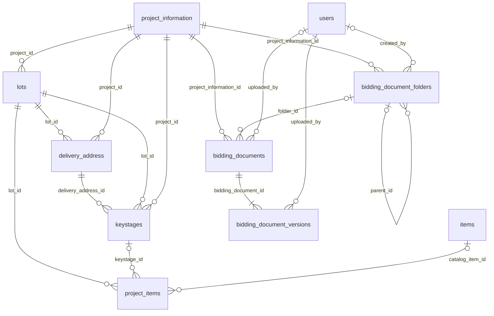

# Input Bidding Document — Implementation Report

Implementation date: 4 October 2026. Reference: [Technical & Functional Audit](input-bidding-document-audit.md). Scope: operation `/project/bidding` and finance `/bidding`, including their complete CRUD workflow and private document management.

The implementation uses one bidding → lot → delivery address → key stage → item contract. It preserves existing flat lot items and historical location/pricing snapshots. Folders, multiple uploads, document replacement/history, authorized downloads/previews, and selected-file ZIP downloads are implemented.

No production or configured shared database migration, deployment, destructive database test, or production data repair was performed. Database-backed verification uses a guarded SQLite `:memory:` harness; document tests use `Storage::fake()`. The historical audit remains unchanged. Existing work outside this scope was preserved. No dependency or memory/timeout setting was changed.

## 1. Root causes fixed

**FIXED** below means implemented and supported by the named passing isolated regression tests. It does not assert deployment parity or repair of previously discarded production data.

| Original problem | Status | Implementation and regression evidence |
| --- | --- | --- |
| Cross-project item deletion | **FIXED** | `ProjectInformation::items()` traverses `ProjectLot` with `HasManyThrough`. Delete uses the target parent and its verified relational cascades. `BiddingWorkflowTest`: “deletes bidding A without deleting bidding B items when their numeric IDs overlap”, explicitly A.id=17/B.lot.id=17. |
| Destructive update contract | **FIXED** | `BiddingService` reconciles submitted collections once in a transaction, retaining stable IDs. Tests cover unchanged, added, removed, omitted, explicitly empty, foreign-parent IDs, and rollback. No unrelated top-level item gate exists. |
| Incorrect edit relationship | **FIXED** | Edit loads actual lots/addresses/stages/items and legacy lot items. Shared create/edit partials receive the same context. Actual operation and finance create/edit/show rendering tests pass. |
| Missing edit status | **FIXED** | Shared form renders all six supported statuses. Requests validate the enum; absent status is preserved on partial update. Rendering, invalid-status, and omission tests pass. |
| Metadata clearing | **FIXED** | Only validated, present fields are mapped. Explicit optional clearing differs from omission. Tests cover dates, preparation, notes, status, legacy address/country, and validation retry. |
| Discarded addresses/stages | **FIXED** | Additive schema columns and scoped address/stage models persist the submitted hierarchy. Multi-lot/address/stage/item test asserts separate rows and identities. |
| Discarded unit cost | **FIXED** | `unit`, `quantity`, and `unit_cost` use the same names throughout. Persistence and exact rounding tests assert saved unit/cost/amount. Unknown legacy pricing remains unknown. |
| Client-controlled totals | **FIXED** | Server `BigDecimal` multiplication and summation determine totals. Tampered 999.99 becomes 25.50 for quantity 2.50 × cost 10.20. ABC stays independently 1000.00. Tests cover tampering, rounding, negative values, and overflow rollback. |
| Duplicate JS stage handler | **FIXED** | A single delegated form handler manages each action. Browser regression verifies one click creates one stage. |
| Broken Add Address | **FIXED** | Shared address template and scoped counter/handler add exactly one address. Browser test exercises nested addition/removal and sparse indices. Backend multi-address persistence also passes. |
| Broken Add Item | **FIXED** | Scoped stage item template and handler populate the intended parent; no conflicting global helper remains. Browser addition/catalog tests and backend persistence pass. |
| Stale PSGC requests | **FIXED** | Abort/request-generation checks discard obsolete responses; visible failure/retry and disabled dependent controls are implemented. Browser tests delay old responses and verify preserved/current selections. Server hierarchy tests reject mismatched ancestry. |
| Catalog identity | **FIXED** | `catalog_item_id` references `items.id`; descriptions and units remain editable snapshots. Bounded search/selection, inactive saved choices, deleted catalog snapshots, and rejected invalid clearing have passing regressions. |
| Document upload absence | **FIXED** | Private Storage service, folder/document/version tables, scoped controllers, and Documents UI exist. Document feature tests cover both route areas, multi-upload, invalid content/size, versions, authorization, file isolation, and storage/DB failures; browser tests cover progress, retry, folder actions, and file actions. |

Other resolved audit symptoms include pre-bid persistence, decimal quantity display, missing-cost display, unique client indices, totals after removal, old-input recovery, duplicate Project ID messages, visible lookup errors/success messages, bounded catalog loading, and removal of obsolete inline scripts. Broader ownership, status-transition, and procurement policy questions remain in section 14.

## 2. Files modified

Paths below identify implementation changes; the audit document is a pre-existing reference, not rewritten for this implementation.

| Area | Files |
| --- | --- |
| Controllers | `app/Http/Controllers/BiddingController.php`, `BiddingFolderController.php`, `BiddingDocumentController.php` |
| Bidding requests | `app/Http/Requests/BiddingRequest.php`, `StoreBiddingRequest.php`, `UpdateBiddingRequest.php` |
| Document/folder requests | `app/Http/Requests/BiddingDocumentRequest.php`, `IndexBiddingDocumentsRequest.php`, `StoreBiddingDocumentRequest.php`, `UpdateBiddingDocumentRequest.php`, `ReplaceBiddingDocumentRequest.php`, `DownloadBiddingDocumentsRequest.php`, `StoreBiddingFolderRequest.php`, `UpdateBiddingFolderRequest.php` |
| Models | `app/Models/ProjectInformation.php`, `ProjectLot.php`, `ProjectItem.php`, `BiddingDeliveryAddress.php`, `BiddingKeyStage.php`, `BiddingDocumentFolder.php`, `BiddingDocument.php`, `BiddingDocumentVersion.php`, `BiddingDocumentFileDeletion.php` |
| Services and authorization | `app/Services/BiddingService.php`, `BiddingDocumentService.php`; `app/Policies/ProjectInformationPolicy.php`; policy registration in `app/Providers/AppServiceProvider.php` |
| Configuration/cleanup | `config/bidding.php`, `config/filesystems.php`; `app/Console/Commands/RetryBiddingFileCleanup.php`; `routes/console.php` |
| Routes | `routes/web.php` |
| Factories | `database/factories/ProjectInformationFactory.php`, `ProjectLotFactory.php`, `BiddingDeliveryAddressFactory.php`, `BiddingKeyStageFactory.php` |
| Migrations | Both new migrations in section 3 |
| JavaScript | `resources/js/bidding.js`, `bidding-documents.js`; guarded module import in `resources/js/app.js` |
| Operation pages | `resources/views/operation/bidding/create.blade.php`, `edit.blade.php`, `show.blade.php`, `index.blade.php` |
| Shared operation partials | Under `resources/views/operation/bidding/partials/`: `_forms`, `_field`, `_lot`, `_address`, `_keystage`, `_item_table`, `_items`, `_show`, `_show_items`, `_documents`, `_search`, `_table` (all `.blade.php`) |
| Finance consumers | `resources/views/finance/bidding/create.blade.php`, `edit.blade.php`, `show.blade.php`, `index.blade.php`; `partials/_search.blade.php`, `partials/_table.blade.php` |
| Shared layouts | `resources/views/layouts/project_app.blade.php`, `finance_app.blade.php`: bidding-scoped mobile navigation/content sizing; existing other-page behavior retained |
| Tests | `tests/BiddingTestCase.php`, `tests/Feature/BiddingWorkflowTest.php`, `BiddingDocumentsTest.php`, `BiddingStoreTest.php`, `tests/Pest.php`, `tests/bidding.test.mjs` |
| Report | `docs/input-bidding-document-implementation.md` |

Production Vite assets were generated under ignored `public/build`. Ignored browser fixtures/screenshots live under `storage/framework/testing/bidding-ui`; they are not application source or deployment artifacts.

## 3. Migrations created

Historical migrations were not edited. These two additive migrations were executed only inside isolated tests:

| Migration | Changes |
| --- | --- |
| `2026_10_04_053818_align_bidding_hierarchy.php` | Nullable PSGC code columns on `lots` and existing `delivery_address`; generic nullable address text; nullable `keystages.name`; nullable item `keystage_id`/`catalog_item_id` with SET NULL FKs; `project_information.calculated_total DECIMAL(15,2)` default 0. |
| `2026_10_04_101906_create_bidding_document_management_tables.php` | Folder, current document, version history, and durable file-deletion outbox tables. Parent and version cascades, nullable uploader FKs to the existing `users.user_id`, unique storage paths/version pairs/UUIDs, and lookup indexes. |

Existing `delivery_address` and `keystages` columns are retained. Legacy flat items are not assigned invented destinations/stages/catalog choices, and missing historic prices are not backfilled. The new aggregate column defaults to zero for existing rows, but Show computes the actual item sum on read; successful updates refresh the stored aggregate. No blanket production backfill runs.

## 4. New models/controllers/services/Form Requests

`BiddingService` handles validated parent writes, exact money, atomic child reconciliation, form projections, and scoped deletion. `BiddingDocumentService` handles private file storage, folders, replacements/version history, ZIP assembly, compensating deletion on failures, and durable cleanup. Controllers retain the existing operation/finance CRUD entry methods and delegate persistence.

New controllers: `BiddingFolderController`, `BiddingDocumentController`. New models: `BiddingDeliveryAddress`, `BiddingKeyStage`, `BiddingDocumentFolder`, `BiddingDocument`, `BiddingDocumentVersion`, `BiddingDocumentFileDeletion`. Existing bidding parent/lot/item models receive typed relationships and decimal casts. New policy: `ProjectInformationPolicy`.

All requests named in section 2 persist exclusively validated fields. Child IDs are additionally verified through their actual submitted parent's relationship inside the transaction. Posting a valid database ID from another bidding document or another nested parent does not make it eligible for update.

## 5. Routes added/changed

Existing seven CRUD URLs and names per area remain. Store and update now redirect to Show with a visible success message so users can immediately manage files. PUT remains the update method; no PATCH route was added.

Let `BASE` be `/project/bidding` with route prefix `project.bidding`, or `/bidding` with prefix `bidding`. Each area has 21 routes: seven existing CRUD routes plus these fourteen additions.

| Method | Path after BASE | Route suffix | Handler |
| --- | --- | --- | --- |
| GET | `/catalog` | `catalog` | `BiddingController::catalog` |
| POST | `/{bidding}/folders` | `folders.store` | `BiddingFolderController::store` |
| PUT | `/{bidding}/folders/{folder}` | `folders.update` | `BiddingFolderController::update` |
| DELETE | `/{bidding}/folders/{folder}` | `folders.destroy` | `BiddingFolderController::destroy` |
| GET | `/{bidding}/documents` | `documents.index` | `BiddingDocumentController::index` |
| POST | `/{bidding}/documents` | `documents.store` | `store` |
| POST | `/{bidding}/documents/zip` | `documents.zip` | `zip` |
| PUT | `/{bidding}/documents/{document}` | `documents.update` | `update` |
| DELETE | `/{bidding}/documents/{document}` | `documents.destroy` | `destroy` |
| POST | `/{bidding}/documents/{document}/replace` | `documents.replace` | `replace` |
| GET | `/{bidding}/documents/{document}/download` | `documents.download` | `download` |
| GET | `/{bidding}/documents/{document}/preview` | `documents.preview` | `preview` |
| GET | `/{bidding}/documents/{document}/history` | `documents.history` | `history` |
| GET | `/{bidding}/documents/{document}/versions/{version}/download` | `documents.versions.download` | `downloadVersion` |

Static `/catalog` and `/documents/zip` routes precede relevant binding routes. `{bidding}` is the numeric `project_information.id`, not the editable string business `project_id`. `{version}` is the version-row numeric ID, checked against the selected document. Authenticated existing PSGC web lookup routes remain available; no other module's lookup contract changed. Read-only Artisan inspection confirms all 42 bidding routes.

## 6. Database relationship diagram



`bidding_document_file_deletions` intentionally has no parent FK: pending physical cleanup survives parent deletion. Its numeric parent ID scopes the managed-path check. Business `project_information.project_id` is a unique string, never a child FK. PSGC codes/name snapshots reside on lots; delivery addresses have their own text and identity beneath the lot.

Parent→lot→item and parent/lot→address cascades remain in effect. Existing stage associations use SET NULL, so the service explicitly removes the target stages and their scoped items during hierarchy deletion. Deleting a stage through raw SQL outside this service retains the existing SET NULL behavior. Application code enforces same-project/lot/address consistency beyond the independent FKs.

## 7. Final bidding payload structure

Illustrative JSON represents the bracketed native HTML payload; values are synthetic. CSRF is omitted here. Edit uses the same shape, adds stable database `id` fields for existing rows, and spoofs PUT. New rows omit `id`.

```json
{
  "hierarchy_present": "1",
  "project_code": "SME",
  "project_name": "Example procurement",
  "project_id": "BID-EXAMPLE-001",
  "procuring_entity": "Example agency",
  "approved_budget_contract_abc": "1000.00",
  "delivery_period": "30",
  "date_of_pre_bid_conference": "2026-10-01",
  "date_of_bid_opening": "2026-10-04",
  "status": "Draft",
  "prepared_by": "Example preparer",
  "prepared_date": "2026-09-30",
  "verified_by": "Example verifier",
  "notes_special_condition": "Example notes",
  "lots": [{
    "lot_no": "Lot 1",
    "country_code": "PH",
    "region_code": null,
    "province_code": null,
    "city_code": null,
    "barangay_code": null,
    "addresses_present": "1",
    "legacy_items_present": "1",
    "addresses": [{
      "delivery_address": "Example delivery destination",
      "keystages_present": "1",
      "keystages": [{
        "name": "Stage A",
        "items_present": "1",
        "items": [{
          "catalog_item_id": 12,
          "item_description": "Saved description snapshot",
          "unit": "pcs",
          "quantity": "2.50",
          "unit_cost": "10.20",
          "total_amount": "25.50",
          "remarks": "Example remarks"
        }]
      }]
    }],
    "legacy_items": []
  }],
  "hierarchy_complete": "1"
}
```

Pre-bid input maps to `pre_bid_conf`. Decimal submission strings are unformatted, nonnegative, and have at most two fractional digits; quantity/cost/ABC/item and aggregate amounts cannot exceed 9,999,999,999,999.99. Scientific notation, commas, excessive precision, and malformed values are rejected. Server totals ignore the supplied preview amount and calculate quantity×cost, rounded HALF_UP once per item to two places, then sum exactly. Brick Math 0.14.8 was already installed through the locked dependency tree; no package was added. JS uses integer decimal arithmetic for display and leaves ABC alone.

Update semantics: omitted scalar or collection preserves it; explicitly supplied optional null clears it; a supplied collection authoritatively retains its submitted IDs and removes other children of that parent. A supplied empty child collection clears it. Lots require at least one when supplied. Presence markers allow removing the last nested row through native form submission. `hierarchy_complete` is at the end of the form so PHP input truncation rejects the entire update before child deletion.

Limits: 20 lots, 20 addresses per lot, 20 stages per address, 100 items per stage or legacy collection, and 1,000 total items. Counts are checked before wildcard validation expands. Lot labels are distinct ignoring case; temporary labels inside the transaction permit safe swaps while preserving IDs.

Legacy `lots[i][legacy_items]` accepts only existing scoped item IDs. If legacy quantity or cost is missing, unchanged pricing retains the saved amount/null exactly; changing pricing requires both quantity and cost. The form displays missing values as missing. Existing item snapshots survive catalog deletion, whose FK becomes null. Existing uncoded location names and flat delivery addresses remain visible and preserved; foreign-country geography is read-only and is recovered from trusted saved rows after validation errors. No guessed catalog ID, country replacement, stage conversion, or historical-price repair occurs.

## 8. Document storage structure

Default private disk `bidding` has root `storage/app/private/bidding`, visibility `private`, and exceptions enabled. Files are stored as:

```text
storage/app/private/bidding/
  bidding-documents/{project_information_id}/
    root/{file_uuid}.{extension}
    {folder_storage_uuid}/{file_uuid}.{extension}
```

Folder UUID and filename UUID are independent of display names. Nested logical folder parents are supported; physical paths do not use user folder names. Rename/move changes metadata and preserves the already stored paths; previous versions can retain older folder UUID paths. Original names are retained as safe filename metadata, never used as physical paths. Database records store metadata, not file binaries. Browser metadata excludes physical disk/path/stored-name values and uses authorized controller URLs.

Upload metadata/current version and its history row commit atomically. Replacement creates a new physical file and increments the version, retaining every previous version including v1. On a DB failure, newly written files are compensated; failed compensation is queued when the database permits it. Deletion first commits document removal plus durable file-deletion records, then attempts physical cleanup. Missing files do not block deletion. Failed cleanup persists attempts/errors and retries through `bidding:cleanup-files`, scheduled every five minutes with overlap protection. Selection favors lower-attempt entries so permanently failing paths do not starve healthy files.

## 9. File validation rules

Configuration lives in `config/bidding.php`. Defaults: PDF, DOC, DOCX, XLS, XLSX, CSV, JPG, JPEG, PNG; maximum **25 MiB per file** (25,600 KB); at most 20 files per API upload; 500 folders per bidding record; metadata pagination 25 by default/100 maximum. ZIP downloads allow at most 100 selected unique documents and 256 MiB of uncompressed input, checked against metadata and actual copied bytes.

The server validates each actual uploaded file, its detected MIME and extension pair, and its size. Office documents detected as generic ZIP must include `[Content_Types].xml` plus `word/document.xml` or `xl/workbook.xml`; arbitrary ZIPs renamed to Office extensions are rejected. No archive is extracted. Files are never executed. Folder/display names reject slashes/control characters; physical paths must match the service-generated UUID pattern for the authorized bidding record.

| Action | Payload |
| --- | --- |
| Upload | Multipart `files[]`, optional scoped `folder_id`, optional `description` (5,000 characters maximum); CSRF required |
| Replace | Multipart `file`; creates next version |
| Edit document | JSON/form `display_name`, `folder_id`, `description`; omitted fields stay unchanged |
| Create/edit folder | `name` (120 characters maximum), optional same-bidding `parent_id`; cycles, duplicate sibling names, and nonempty deletion rejected |
| ZIP | `document_ids[]`, unique, within current bidding and configured limits |

The UI accepts multiple selection and drag/drop, but uploads files sequentially in separate requests for individual progress, failure, cancellation, and retry. One API request containing multiple files is atomic; the UI queue allows successful files to remain uploaded when another file fails. HTTP 413, authentication/session failures, validation errors, and server failures have visible messages. Preview supports PDF/JPEG/PNG; other allowed types download. Preview responses use inline disposition, `nosniff`, private/no-store caching, and sandbox CSP.

## 10. Authorization behavior

Policies are registered explicitly and apply to read/create/update/delete and file actions. Existing route middleware remains:

- Operation: authentication, selected MMC company context/active MMC membership, and `user` role.
- Finance: authentication and `finance` role; existing access to the shared bidding register is retained without introducing MMC middleware.

Every folder/document/version URL or submitted parent/folder ID is scoped to its actual bidding parent. Foreign nested resources return 404; disallowed users receive middleware/policy denial. Unauthenticated requests follow the existing web authentication behavior. CSRF applies to mutations. Metadata, downloads, histories, previews, ZIPs, replacement, and deletion all pass authorization.

No company/owner column or invented per-document ownership policy was added. Authorized operation and finance users continue to share bidding records under existing rules. An admin role alone does not imply the operation `user` role. Fine-grained owner/company/status permissions require a business decision; the old audit's broad ownership concern is not declared resolved by an entrance-equivalent policy.

Finance compatibility was reviewed across routes, policy, controller wrappers, catalog, shared create/edit/show partials, listing links/search/success messages, and document URLs. Both areas use the same persistence services and payload. Passing HTTP cases cover finance rendering/save, shared-register access, listing, upload, and middleware denial.

## 11. Tests created

`tests/BiddingTestCase.php` forces SQLite `:memory:` with URL cleared and connection purged, asserts isolation before selected migrations, and resets RefreshDatabase state per case. `tests/Pest.php` excludes these bidding tests from the generic shared-database binding. Document tests fake only their document disk. The old finance blank-ABC test was repaired and now asserts real stored money/hierarchy.

- `BiddingWorkflowTest.php`: overlapping numeric IDs, canonical persistence in both areas, all reconciliation levels, stable IDs, foreign-parent rejection/rollback, metadata omission/clearing, date/status/money/catalog/PSGC rules, decimal rounding/overflow, duplicate identity, array limits, truncated forms, legacy null pricing/catalog deletion/country and retry, actual Blade rendering, listing, and role/company gates.
- `BiddingDocumentsTest.php`: both route areas, single/multi-upload, real MIME/Office/image checks, size/count limits, custom nested folders/cycles, scoped rename/move, previews, history/current/old-version downloads, missing files, ZIPs, related-record isolation, parent deletion, DB rollback compensation, durable storage failures, cleanup fairness, and corrupted-path refusal.
- `BiddingStoreTest.php`: blank ABC persists zero while the independent calculated amount persists correctly through finance.
- `tests/bidding.test.mjs`: standalone Chromium runs actual JS with intercepted lookup/document endpoints; add/remove/indexing, decimal display/ABC independence, legacy pricing, session/submit state, lookup races/recovery, safe document rendering, progress/error/retry, folders/versions/ZIP, and exported actual Blade responsive rendering.

Browser fixtures are rendered by real Laravel HTTP tests in the isolated database, then loaded by standalone Playwright with synthetic API responses. These are repeatable local integration checks, not authenticated production browser tests or a real remote Storage integration.

## 12. Test results

Final combined command: `php vendor/bin/pest tests/Feature/BiddingWorkflowTest.php tests/Feature/BiddingStoreTest.php tests/Feature/BiddingDocumentsTest.php --compact` with `BIDDING_RENDER_HTML=1` for fixture exports. **113 tests passed, 878 assertions, 40.82 seconds.**

| Verification | Result |
| --- | --- |
| Core workflow + repaired finance store test | 75 passing cases / 557 assertions within the combined run |
| Folder/document feature tests | 38 passing cases / 321 assertions within the combined run |
| Actual Blade rendering/export after final layout containment change | 6 passed / 88 assertions, 2.67 seconds |
| Bidding browser behavior and responsive rendering | Final browser verification pending |
| Existing Project Details browser regression, shared-bundle compatibility | 3 passed, no failures/skips |
| PHP formatting | All implementation PHP paths formatted; final `php vendor/bin/pint --dirty --format agent` passed |

Case totals include parameterized datasets. Additional rendering runs are verification repeats, not additional distinct PHP cases. Node/Chromium checks require subprocess access in this sandbox; a blocked initial launch was retried successfully for the compatibility checks.

The complete repository test suite was not run: unrelated existing tests retain database configuration that has not been proven isolated. Before running `php artisan test --compact` for the whole repository, configure and verify a dedicated full-suite database/storage environment. The narrow bidding harness does not make other tests safe automatically. No production MySQL save/delete behavior or representative large production dataset was exercised.

## 13. Build result

Final `npm run build` **passed** with Vite 5.4.21 after the last template/layout adjustments: 61 modules transformed, 2.95 seconds. Assets: `app-DkYiN6ib.css` (96.02 kB), `app-WuKkAfAG.js` (139.69 kB), and `manifest.json`. The first attempt encountered a sandbox `spawn EPERM`; allowing the compiler subprocess completed the local asset build. Dependencies/lockfiles were not changed.

PHP formatting includes all implementation PHP paths, including files committed during the session, followed by the required `php vendor/bin/pint --dirty --format agent`. Git whitespace verification is part of the final checks.

## 14. Remaining business-rule questions

1. Confirm independent approved budget vs calculated estimate, whether zero/blank ABC is acceptable, and whether either amount controls awards or approvals. Current blank ABC preserves the previous zero default.
2. Confirm two-place quantity/price and per-item HALF_UP rounding, fractional/zero quantities, permitted units, catalogue price defaults/manual unit-price edits, and tax/discount treatment. No manual total override was introduced.
3. Confirm optional addresses/stages/items for drafts and chosen row/size/folder/ZIP limits. New items need a catalog choice; saved snapshots can survive catalog deletion.
4. Confirm status transitions, direct initial Awarded/Completed/Cancelled states, date chronology, delivery-day bounds, edit/delete restrictions, and who may prepare/verify. Current six statuses and editable attribution remain, with validation but no invented approval workflow.
5. Confirm the shared operation/finance register, required future company/owner scope, globally unique business Project ID format, and any association with the main Project Tracker module.
6. Decide legacy hierarchy conversion, missing historical pricing recovery, international geography editing, version retention/storage quotas, and required audit history. The implementation preserves recoverable saved data and does not reconstruct discarded input.

## 15. Remaining risks

- Deployment schema/cascades/SQL mode/users key parity and deployed bundle parity are unverified. In particular, confirm production `users.user_id` is compatible in width/signedness with the new uploader/creator foreign keys. Isolated SQLite tests do not replace a staging MySQL migration/FK/decimal smoke test. Existing corrupt or cross-linked hierarchy data was not repaired.
- Updates lock the parent and are atomic; no optimistic stale-editor version token exists. A later valid full form can replace an earlier editor's intent. Confirm a conflict policy before introducing it.
- Relational transactions cannot atomically commit filesystem writes. Ordinary DB/storage failures have tested compensation/outbox recovery, but a process kill between file write and DB commit may leave an unreferenced UUID file. Simultaneous DB and storage unavailability may prevent recording compensation. Persistent backups and operational reconciliation remain necessary.
- Previous versions consume storage until explicit document/bidding deletion; no retention policy, antivirus service, or quota service was introduced. Allowed MIME checks validate format boundaries, not document trustworthiness.
- All descendants render for a selected bidding record. Catalog options/search and write limits are bounded, but representative production document size, peak memory, query count, and remote disk behavior were not benchmarked. Oversized legacy records may require a separately designed partial-edit workflow.
- Private disk persistence/permissions, scheduler execution, temporary ZIP capacity, PHP/proxy upload/input limits, and web-runtime extensions must be configured. A configured remote disk must remain private; no public storage link grants access to bidding files.
- Hierarchy and document migration rollbacks drop newly stored relationships/history/outbox data. Do not blindly roll them back after users have entered data. Use release/DB/filesystem backups and a reviewed recovery plan.
- The dormant legacy `New\Item::project()` association remains outside this active workflow; main Project Tracker, Warehouse, Delivery, HRIS, and JARVIS logic were not rewritten.

## 16. Exact deployment commands

These commands are instructions for an operator; **they were not executed against a production/shared database or deployed environment**. Run from the intended release directory with its verified environment. First take coordinated database and private-file backups and verify the existing parent/lot/item/address cascades, `users.user_id`, and required base migrations on an isolated staging copy.

Verify PHP 8.3 with `fileinfo`, `zip`, the target PDO driver, and `pdo_sqlite` for isolated tests. Use the locked dependency versions. Ensure Playwright/browser availability for Node browser tests; an existing browser can be supplied through `BIDDING_BROWSER_EXECUTABLE` without changing application dependencies.

```bash
composer install --no-interaction --prefer-dist
php vendor/bin/pest tests/Feature/BiddingWorkflowTest.php tests/Feature/BiddingStoreTest.php tests/Feature/BiddingDocumentsTest.php --compact
```

Export browser fixtures before running the responsive case. Choose the command matching the shell:

```bash
BIDDING_RENDER_HTML=1 php vendor/bin/pest tests/Feature/BiddingWorkflowTest.php --filter='renders|bounds the initial catalog|preserves legacy foreign country' --compact
```

```powershell
$env:BIDDING_RENDER_HTML = '1'
php vendor/bin/pest tests/Feature/BiddingWorkflowTest.php --filter='renders|bounds the initial catalog|preserves legacy foreign country' --compact
Remove-Item Env:BIDDING_RENDER_HTML
```

```bash
npm ci
npm run build
node --test tests/bidding.test.mjs
php artisan route:list --path=bidding --except-vendor --no-interaction
```

Before production activation set the release environment:

```dotenv
BIDDING_DOCUMENT_DISK=bidding
BIDDING_DOCUMENT_MAX_SIZE_KB=25600
```

Keep `storage/app/private/bidding` on persistent, backed-up storage and writable by the application/scheduler account across releases. Keep it outside the web server's document root. Use an explicitly private remote disk if configured instead. Do not run `storage:link` for this disk.

The web PHP/proxy configuration should permit a 25 MiB file plus multipart overhead: for the sequential UI, `upload_max_filesize=25M`, `post_max_size=26M` or greater, and an appropriate proxy body limit; `max_file_uploads=20` covers the API batch count. A client using the full 20×25 MiB batch needs a correspondingly larger combined body limit. Use `max_input_vars=50000` if accepting the largest configured nested form; the end marker rejects truncated hierarchy payloads. Configure limits in the actual web/FPM runtime, not only CLI. Provision temporary space for ZIP input staging plus its final archive, up to roughly twice the configured 256 MiB input limit per concurrent request.

After staging smoke tests and backups, activate the two targeted migrations with the application held in maintenance:

```bash
php artisan down --retry=60
composer install --no-dev --no-interaction --prefer-dist --optimize-autoloader
php artisan config:clear
php artisan migrate --path=database/migrations/2026_10_04_053818_align_bidding_hierarchy.php --force --no-interaction
php artisan migrate --path=database/migrations/2026_10_04_101906_create_bidding_document_management_tables.php --force --no-interaction
php artisan config:cache
php artisan route:cache
php artisan view:cache
php artisan bidding:cleanup-files --limit=100
php artisan up
```

Build `public/build` in the release/build pipeline before activation; do not omit built assets when publishing a release. Keep the app in maintenance if a migration fails, inspect the database state, and restore/recover deliberately: MySQL DDL can commit independently. No automatic deployment/rollback command was run in this task.

Enable the Laravel scheduler. Example Linux crontab, replacing `/path/to/release` with the absolute deployment path:

```cron
* * * * * cd /path/to/release && php artisan schedule:run >> /dev/null 2>&1
```

On Windows use Task Scheduler every minute with `php artisan schedule:run` and the release working directory. An existing scheduler requires no duplicate entry. No queue worker is required for the implemented cleanup command. Monitor command failures and `bidding_document_file_deletions` attempts/errors; retry manually with `php artisan bidding:cleanup-files --limit=100` after storage recovers.

After activation, perform authorized staging/production smoke checks appropriate to the environment: both role areas, hierarchy edit/reload, independent budget/total, file upload/history/download, folder movement, and isolated record deletion. Use controlled records and the reviewed deployment authorization. The implementation itself performs no automatic production data repair.
